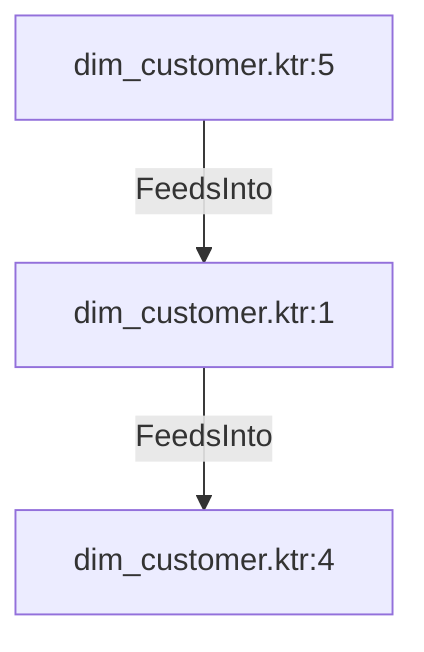

# dim_customer.ktr:1 (TransformNode)

## Properties

| Key | Value |
|---|---|
| `node_type` | Unmapped |
| `raw` | <step>
    <name>Create surrogate key</name>
    <type>Sequence</type>
    <description/>
    <distribute>Y</distribute>
    <custom_distribution/>
    <copies>1</copies>
    <partitioning>
      <method>none</method>
      <schema_name/>
    </partitioning>
    <valuename>dim_customer_id</valuename>
    <use_database>N</use_database>
    <connection>AdventureWorks</connection>
    <schema/>
    <seqname>SEQ_</seqname>
    <use_counter>Y</use_counter>
    <counter_name/>
    <start_at>1</start_at>
    <increment_by>1</increment_by>
    <max_value>999999999</max_value>
    <attributes/>
    <cluster_schema/>
    <remotesteps>
      <input>
      </input>
      <output>
      </output>
    </remotesteps>
    <GUI>
      <xloc>336</xloc>
      <yloc>592</yloc>
      <draw>Y</draw>
    </GUI>
  </step> |
| `reason` | unrecognized step type: Sequence |

## Relationships

### FeedsInto

- → dim_customer.ktr:4 (`65f972fc-cf69-5b31-b267-600dd103faef`)
- ← dim_customer.ktr:5 (`9459e9c7-d7fd-59ef-bdd6-a59b10b99bb4`)

## Diagram

## Evidence

- `a364be38-bc13-5a15-9f84-a4e2324e00d1` — <step>
    <name>Create surrogate key</name>
    <type>Sequence</type>
    <description/>
    <distribute>Y</distribute>
    <custom_distribution/>
    <copies>1</copies>
    <partitioning>
      <method>none</method>
      <schema_name/>
    </partitioning>
    <valuename>dim_customer_id</valuename>
    <use_database>N</use_database>
    <connection>AdventureWorks</connection>
    <schema/>
    <seqname>SEQ_</seqname>
    <use_counter>Y</use_counter>
    <counter_name/>
    <start_at>1</start_at>
    <increment_by>1</increment_by>
    <max_value>999999999</max_value>
    <attributes/>
    <cluster_schema/>
    <remotesteps>
      <input>
      </input>
      <output>
      </output>
    </remotesteps>
    <GUI>
      <xloc>336</xloc>
      <yloc>592</yloc>
      <draw>Y</draw>
    </GUI>
  </step> (confidence: 1.00)
