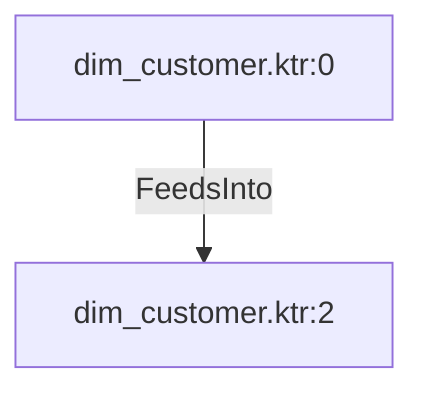

# dim_customer.ktr:2 (TransformNode)

## Properties

| Key | Value |
|---|---|
| `node_type` | Unmapped |
| `raw` | <step>
    <name>Dimension lookup/update</name>
    <type>DimensionLookup</type>
    <description/>
    <distribute>Y</distribute>
    <custom_distribution/>
    <copies>1</copies>
    <partitioning>
      <method>none</method>
      <schema_name/>
    </partitioning>
    <schema>eae_data_management_mmjja</schema>
    <table>dim_customer</table>
    <connection>eae_data_management</connection>
    <commit>100</commit>
    <update>Y</update>
    <fields>
      <key>
        <name>CustomerID</name>
        <lookup>customer_id</lookup>
      </key>
      <date>
        <name/>
        <from>start_date</from>
        <to>end_date</to>
      </date>
      <field>
        <name>StoreID</name>
        <lookup>reseller_store_id</lookup>
        <update>Insert</update>
      </field>
      <field>
        <name>Name</name>
        <lookup>reseller_store_name</lookup>
        <update>Insert</update>
      </field>
      <field>
        <name>calculated_is_reseller</name>
        <lookup>is_reseller</lookup>
        <update>Insert</update>
      </field>
      <field>
        <name>Title</name>
        <lookup>person_title</lookup>
        <update>Insert</update>
      </field>
      <field>
        <name>FirstName</name>
        <lookup>person_first_name</lookup>
        <update>Insert</update>
      </field>
      <field>
        <name>MiddleName</name>
        <lookup>person_middle_name</lookup>
        <update>Insert</update>
      </field>
      <field>
        <name>LastName</name>
        <lookup>person_last_name</lookup>
        <update>Insert</update>
      </field>
      <field>
        <name>Suffix</name>
        <lookup>person_suffix</lookup>
        <update>Insert</update>
      </field>
      <return>
        <name>dim_customer_id</name>
        <rename/>
        <creation_method>tablemax</creation_method>
        <use_autoinc>N</use_autoinc>
        <version>version_number</version>
      </return>
    </fields>
    <sequence/>
    <min_year>1900</min_year>
    <max_year>2199</max_year>
    <cache_size>5000</cache_size>
    <preload_cache>N</preload_cache>
    <use_start_date_alternative>N</use_start_date_alternative>
    <start_date_alternative>none</start_date_alternative>
    <start_date_field_name/>
    <useBatch>N</useBatch>
    <attributes/>
    <cluster_schema/>
    <remotesteps>
      <input>
      </input>
      <output>
      </output>
    </remotesteps>
    <GUI>
      <xloc>1280</xloc>
      <yloc>592</yloc>
      <draw>Y</draw>
    </GUI>
  </step> |
| `reason` | unrecognized step type: DimensionLookup |

## Relationships

### FeedsInto

- ← dim_customer.ktr:0 (`c1cc5dda-2f9a-5000-b82e-d46311c68b33`)

## Diagram

## Evidence

- `93f18404-1194-5dcd-a540-b6c54be215c5` — <step>
    <name>Dimension lookup/update</name>
    <type>DimensionLookup</type>
    <description/>
    <distribute>Y</distribute>
    <custom_distribution/>
    <copies>1</copies>
    <partitioning>
      <method>none</method>
      <schema_name/>
    </partitioning>
    <schema>eae_data_management_mmjja</schema>
    <table>dim_customer</table>
    <connection>eae_data_management</connection>
    <commit>100</commit>
    <update>Y</update>
    <fields>
      <key>
        <name>CustomerID</name>
        <lookup>customer_id</lookup>
      </key>
      <date>
        <name/>
        <from>start_date</from>
        <to>end_date</to>
      </date>
      <field>
        <name>StoreID</name>
        <lookup>reseller_store_id</lookup>
        <update>Insert</update>
      </field>
      <field>
        <name>Name</name>
        <lookup>reseller_store_name</lookup>
        <update>Insert</update>
      </field>
      <field>
        <name>calculated_is_reseller</name>
        <lookup>is_reseller</lookup>
        <update>Insert</update>
      </field>
      <field>
        <name>Title</name>
        <lookup>person_title</lookup>
        <update>Insert</update>
      </field>
      <field>
        <name>FirstName</name>
        <lookup>person_first_name</lookup>
        <update>Insert</update>
      </field>
      <field>
        <name>MiddleName</name>
        <lookup>person_middle_name</lookup>
        <update>Insert</update>
      </field>
      <field>
        <name>LastName</name>
        <lookup>person_last_name</lookup>
        <update>Insert</update>
      </field>
      <field>
        <name>Suffix</name>
        <lookup>person_suffix</lookup>
        <update>Insert</update>
      </field>
      <return>
        <name>dim_customer_id</name>
        <rename/>
        <creation_method>tablemax</creation_method>
        <use_autoinc>N</use_autoinc>
        <version>version_number</version>
      </return>
    </fields>
    <sequence/>
    <min_year>1900</min_year>
    <max_year>2199</max_year>
    <cache_size>5000</cache_size>
    <preload_cache>N</preload_cache>
    <use_start_date_alternative>N</use_start_date_alternative>
    <start_date_alternative>none</start_date_alternative>
    <start_date_field_name/>
    <useBatch>N</useBatch>
    <attributes/>
    <cluster_schema/>
    <remotesteps>
      <input>
      </input>
      <output>
      </output>
    </remotesteps>
    <GUI>
      <xloc>1280</xloc>
      <yloc>592</yloc>
      <draw>Y</draw>
    </GUI>
  </step> (confidence: 1.00)
