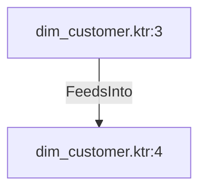

# dim_customer.ktr:3 (TransformNode)

## Properties

| Key | Value |
|---|---|
| `columns` | [] |
| `node_type` | Source |
| `object_name` | Person.Person |

## Relationships

### FeedsInto

- → dim_customer.ktr:4 (`65f972fc-cf69-5b31-b267-600dd103faef`)

## Diagram

## Evidence

- `73d7bda6-5a26-57f9-b97e-10776a60aa0c` — Person.Person (confidence: 1.00)
