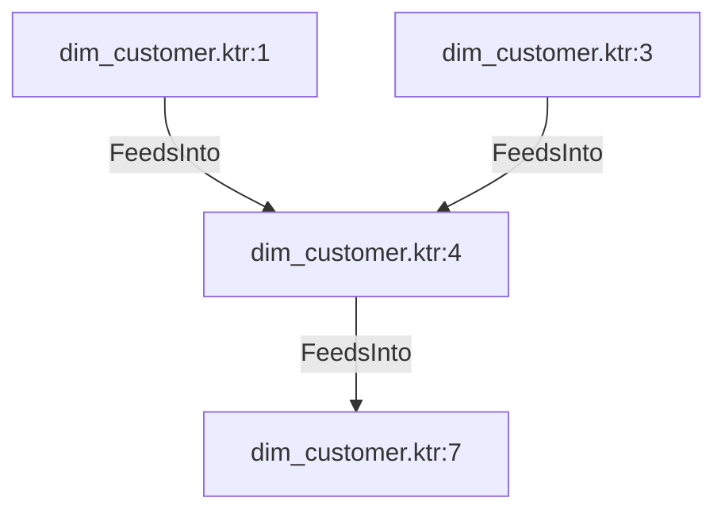

# dim_customer.ktr:4 (TransformNode)

## Properties

| Key | Value |
|---|---|
| `join_kind` | Left |
| `keys` | [] |
| `left` | 0 |
| `node_type` | Join |
| `right` | 0 |

## Relationships

### FeedsInto

- → dim_customer.ktr:7 (`91a74c3f-86b8-5ea3-989e-5d6d577864fd`)
- ← dim_customer.ktr:1 (`8d1a81e6-f0e2-5b1d-bae9-2e2600ed81c8`)
- ← dim_customer.ktr:3 (`71c485ba-3183-585d-962e-71ad1499c739`)

## Diagram

## Evidence

- `9601aa3e-28df-5bff-9638-3070b46fe00f` — Left JOIN ON [] (confidence: 1.00)
