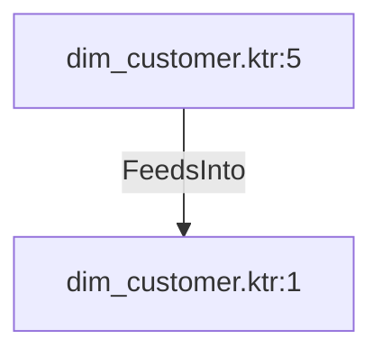

# dim_customer.ktr:5 (TransformNode)

## Properties

| Key | Value |
|---|---|
| `columns` | [] |
| `node_type` | Source |
| `object_name` | Sales.Customer |

## Relationships

### FeedsInto

- → dim_customer.ktr:1 (`8d1a81e6-f0e2-5b1d-bae9-2e2600ed81c8`)

## Diagram

## Evidence

- `c379e29b-9fec-5e55-9dbb-4e59b97d6764` — Sales.Customer (confidence: 1.00)
