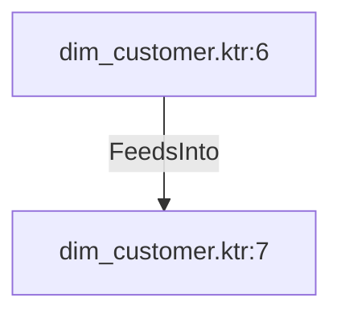

# dim_customer.ktr:6 (TransformNode)

## Properties

| Key | Value |
|---|---|
| `columns` | [] |
| `node_type` | Source |
| `object_name` | Sales.SalesPerson |

## Relationships

### FeedsInto

- → dim_customer.ktr:7 (`91a74c3f-86b8-5ea3-989e-5d6d577864fd`)

## Diagram

## Evidence

- `58ae59ff-fcd5-5e09-9d92-ac4ca497747a` — Sales.SalesPerson (confidence: 1.00)
