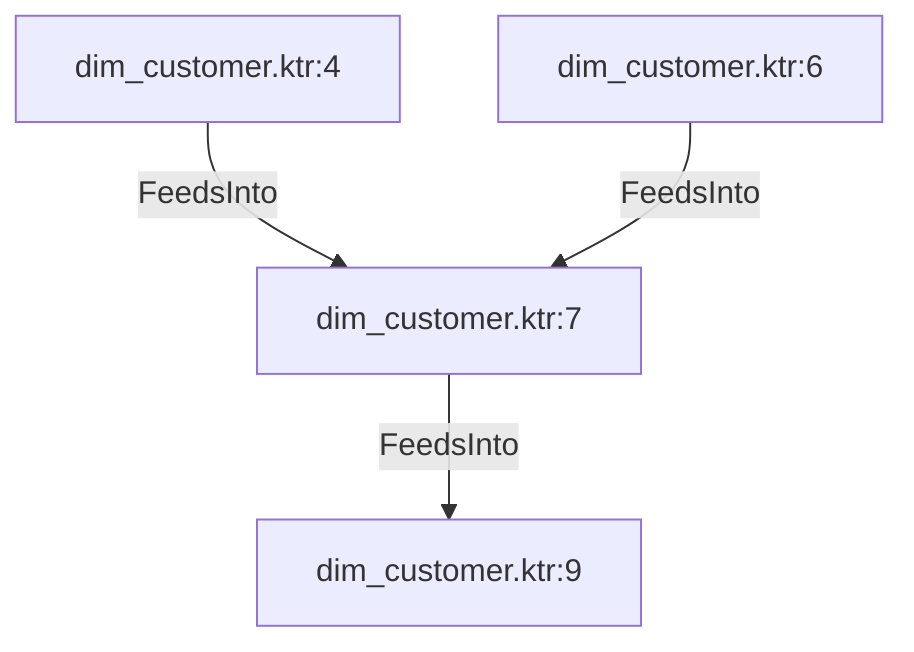

# dim_customer.ktr:7 (TransformNode)

## Properties

| Key | Value |
|---|---|
| `join_kind` | Left |
| `keys` | [] |
| `left` | 0 |
| `node_type` | Join |
| `right` | 0 |

## Relationships

### FeedsInto

- → dim_customer.ktr:9 (`13a1cc5a-f528-5e37-aa60-650e1632c222`)
- ← dim_customer.ktr:4 (`65f972fc-cf69-5b31-b267-600dd103faef`)
- ← dim_customer.ktr:6 (`f059165c-f525-5050-92d6-a43c94e62f9d`)

## Diagram

## Evidence

- `5922e60b-7aa9-5cc4-bd95-16d970660829` — Left JOIN ON [] (confidence: 1.00)
