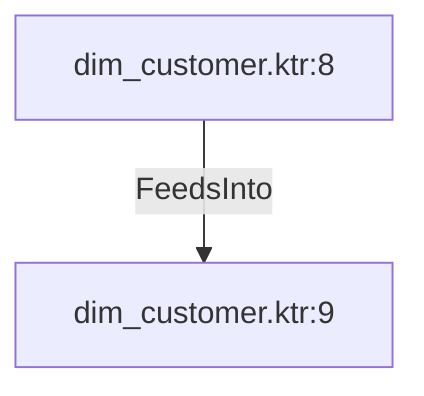

# dim_customer.ktr:8 (TransformNode)

## Properties

| Key | Value |
|---|---|
| `columns` | [] |
| `node_type` | Source |
| `object_name` | Sales.Store |

## Relationships

### FeedsInto

- → dim_customer.ktr:9 (`13a1cc5a-f528-5e37-aa60-650e1632c222`)

## Diagram

## Evidence

- `73d13232-9539-5031-a37f-8f6549f8d84e` — Sales.Store (confidence: 1.00)
