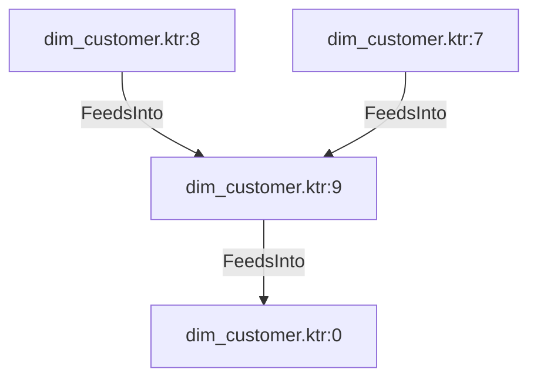

# dim_customer.ktr:9 (TransformNode)

## Properties

| Key | Value |
|---|---|
| `join_kind` | Left |
| `keys` | [] |
| `left` | 0 |
| `node_type` | Join |
| `right` | 0 |

## Relationships

### FeedsInto

- → dim_customer.ktr:0 (`c1cc5dda-2f9a-5000-b82e-d46311c68b33`)
- ← dim_customer.ktr:8 (`72ed4b3c-c06b-508e-ba80-300d617b834d`)
- ← dim_customer.ktr:7 (`91a74c3f-86b8-5ea3-989e-5d6d577864fd`)

## Diagram

## Evidence

- `f0dd3375-e633-5352-9ad7-60a7ed1fe87e` — Left JOIN ON [] (confidence: 1.00)
