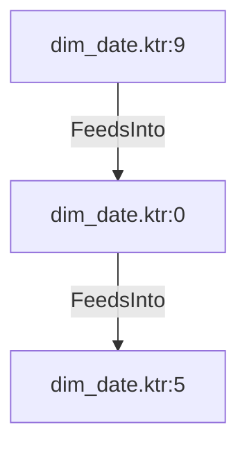

# dim_date.ktr:0 (TransformNode)

## Properties

| Key | Value |
|---|---|
| `node_type` | Unmapped |
| `raw` | <step>
    <name>Calculate API Url</name>
    <type>ScriptValueMod</type>
    <description/>
    <distribute>Y</distribute>
    <custom_distribution/>
    <copies>1</copies>
    <partitioning>
      <method>none</method>
      <schema_name/>
    </partitioning>
    <compatible>N</compatible>
    <optimizationLevel>9</optimizationLevel>
    <jsScripts>
      <jsScript>
        <jsScript_type>0</jsScript_type>
        <jsScript_name>Script 1</jsScript_name>
        <jsScript_script>var api_url = url + "/" + year_number + "/" + holiday_country_code;</jsScript_script>
      </jsScript>
    </jsScripts>
    <fields>
      <field>
        <name>api_url</name>
        <rename>api_url</rename>
        <type>String</type>
        <length>-1</length>
        <precision>-1</precision>
        <replace>N</replace>
      </field>
    </fields>
    <attributes/>
    <cluster_schema/>
    <remotesteps>
      <input>
      </input>
      <output>
      </output>
    </remotesteps>
    <GUI>
      <xloc>288</xloc>
      <yloc>144</yloc>
      <draw>Y</draw>
    </GUI>
  </step> |
| `reason` | unrecognized step type: ScriptValueMod |

## Relationships

### FeedsInto

- → dim_date.ktr:5 (`d0a86255-f80e-5729-aff0-b5f77fe8ed2a`)
- ← dim_date.ktr:9 (`abb32620-4c9c-5a19-9b84-6455af079744`)

## Diagram

## Evidence

- `0ed4b621-67f1-510a-a989-a9c04b98af63` — <step>
    <name>Calculate API Url</name>
    <type>ScriptValueMod</type>
    <description/>
    <distribute>Y</distribute>
    <custom_distribution/>
    <copies>1</copies>
    <partitioning>
      <method>none</method>
      <schema_name/>
    </partitioning>
    <compatible>N</compatible>
    <optimizationLevel>9</optimizationLevel>
    <jsScripts>
      <jsScript>
        <jsScript_type>0</jsScript_type>
        <jsScript_name>Script 1</jsScript_name>
        <jsScript_script>var api_url = url + "/" + year_number + "/" + holiday_country_code;</jsScript_script>
      </jsScript>
    </jsScripts>
    <fields>
      <field>
        <name>api_url</name>
        <rename>api_url</rename>
        <type>String</type>
        <length>-1</length>
        <precision>-1</precision>
        <replace>N</replace>
      </field>
    </fields>
    <attributes/>
    <cluster_schema/>
    <remotesteps>
      <input>
      </input>
      <output>
      </output>
    </remotesteps>
    <GUI>
      <xloc>288</xloc>
      <yloc>144</yloc>
      <draw>Y</draw>
    </GUI>
  </step> (confidence: 1.00)
