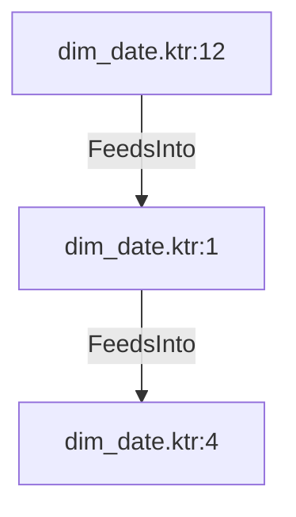

# dim_date.ktr:1 (TransformNode)

## Properties

| Key | Value |
|---|---|
| `node_type` | Unmapped |
| `raw` | <step>
    <name>Calculate KEY for dim_date_id </name>
    <type>Formula</type>
    <description/>
    <distribute>Y</distribute>
    <custom_distribution/>
    <copies>1</copies>
    <partitioning>
      <method>none</method>
      <schema_name/>
    </partitioning>
    <formula>
      <field_name>calculated_dim_date_id</field_name>
      <formula_string>[year_number]*10000 + [month_number]*100 + [day_of_the_month_number]</formula_string>
      <value_type>Integer</value_type>
      <value_length>-1</value_length>
      <value_precision>-1</value_precision>
      <replace_field/>
    </formula>
    <attributes/>
    <cluster_schema/>
    <remotesteps>
      <input>
      </input>
      <output>
      </output>
    </remotesteps>
    <GUI>
      <xloc>208</xloc>
      <yloc>32</yloc>
      <draw>Y</draw>
    </GUI>
  </step> |
| `reason` | unrecognized step type: Formula |

## Relationships

### FeedsInto

- → dim_date.ktr:4 (`75430eb0-f4fe-5215-ad6c-1c4734756c60`)
- ← dim_date.ktr:12 (`1384bd3b-6b03-5a37-85d8-6bff4ad78b34`)

## Diagram

## Evidence

- `ff0c25b6-bdff-50e9-8f2a-03b6def6ecd8` — <step>
    <name>Calculate KEY for dim_date_id </name>
    <type>Formula</type>
    <description/>
    <distribute>Y</distribute>
    <custom_distribution/>
    <copies>1</copies>
    <partitioning>
      <method>none</method>
      <schema_name/>
    </partitioning>
    <formula>
      <field_name>calculated_dim_date_id</field_name>
      <formula_string>[year_number]*10000 + [month_number]*100 + [day_of_the_month_number]</formula_string>
      <value_type>Integer</value_type>
      <value_length>-1</value_length>
      <value_precision>-1</value_precision>
      <replace_field/>
    </formula>
    <attributes/>
    <cluster_schema/>
    <remotesteps>
      <input>
      </input>
      <output>
      </output>
    </remotesteps>
    <GUI>
      <xloc>208</xloc>
      <yloc>32</yloc>
      <draw>Y</draw>
    </GUI>
  </step> (confidence: 1.00)
