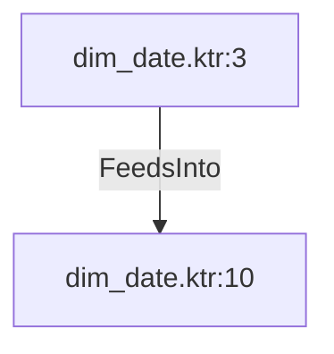

# dim_date.ktr:10 (TransformNode)

## Properties

| Key | Value |
|---|---|
| `columns` | ["calculated_dim_date_id","date","day_of_the_week_number","day_of_the_week_text","day_of_the_month_number","day_of_the_month_text","month_number","month_text","day_of_the_year","week_of_the_year","quarter_number","year_number","second_calculated_holiday_name","northern_hemisphere","southern_hemisphere","is_holiday"] |
| `node_type` | Sink |
| `object_name` | dim_date |

## Relationships

### FeedsInto

- ← dim_date.ktr:3 (`d31a1a57-590f-5b04-af4f-6d7993063e05`)

## Diagram

## Evidence

- `f72121dd-51d0-5162-b772-9746e6cf06b6` — dim_date (confidence: 1.00)
