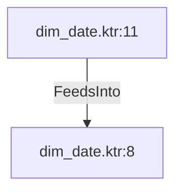

# dim_date.ktr:11 (TransformNode)

## Properties

| Key | Value |
|---|---|
| `node_type` | Unmapped |
| `raw` | <step>
    <name>seasons</name>
    <type>CsvInput</type>
    <description/>
    <distribute>Y</distribute>
    <custom_distribution/>
    <copies>1</copies>
    <partitioning>
      <method>none</method>
      <schema_name/>
    </partitioning>
    <filename>${Internal.Entry.Current.Directory}/seasons_by_month.csv</filename>
    <filename_field/>
    <rownum_field/>
    <include_filename>N</include_filename>
    <separator>,</separator>
    <enclosure>"</enclosure>
    <header>Y</header>
    <buffer_size>50000</buffer_size>
    <lazy_conversion>Y</lazy_conversion>
    <add_filename_result>N</add_filename_result>
    <parallel>N</parallel>
    <newline_possible>N</newline_possible>
    <format>Unix</format>
    <encoding/>
    <fields>
      <field>
        <name>northern_hemisphere</name>
        <type>String</type>
        <format/>
        <currency>$</currency>
        <decimal>.</decimal>
        <group>,</group>
        <length>6</length>
        <precision>-1</precision>
        <trim_type>none</trim_type>
      </field>
      <field>
        <name>southern_hemisphere</name>
        <type>String</type>
        <format/>
        <currency>$</currency>
        <decimal>.</decimal>
        <group>,</group>
        <length>6</length>
        <precision>-1</precision>
        <trim_type>none</trim_type>
      </field>
      <field>
        <name>month</name>
        <type>Integer</type>
        <format>#</format>
        <currency>$</currency>
        <decimal>.</decimal>
        <group>,</group>
        <length>15</length>
        <precision>0</precision>
        <trim_type>none</trim_type>
      </field>
    </fields>
    <attributes/>
    <cluster_schema/>
    <remotesteps>
      <input>
      </input>
      <output>
      </output>
    </remotesteps>
    <GUI>
      <xloc>560</xloc>
      <yloc>224</yloc>
      <draw>Y</draw>
    </GUI>
  </step> |
| `reason` | unrecognized step type: CsvInput |

## Relationships

### FeedsInto

- → dim_date.ktr:8 (`3961c4b6-630c-5713-9bc8-387784e6dbee`)

## Diagram

## Evidence

- `2e87f6b5-686e-522e-a424-8b1ed430195f` — <step>
    <name>seasons</name>
    <type>CsvInput</type>
    <description/>
    <distribute>Y</distribute>
    <custom_distribution/>
    <copies>1</copies>
    <partitioning>
      <method>none</method>
      <schema_name/>
    </partitioning>
    <filename>${Internal.Entry.Current.Directory}/seasons_by_month.csv</filename>
    <filename_field/>
    <rownum_field/>
    <include_filename>N</include_filename>
    <separator>,</separator>
    <enclosure>"</enclosure>
    <header>Y</header>
    <buffer_size>50000</buffer_size>
    <lazy_conversion>Y</lazy_conversion>
    <add_filename_result>N</add_filename_result>
    <parallel>N</parallel>
    <newline_possible>N</newline_possible>
    <format>Unix</format>
    <encoding/>
    <fields>
      <field>
        <name>northern_hemisphere</name>
        <type>String</type>
        <format/>
        <currency>$</currency>
        <decimal>.</decimal>
        <group>,</group>
        <length>6</length>
        <precision>-1</precision>
        <trim_type>none</trim_type>
      </field>
      <field>
        <name>southern_hemisphere</name>
        <type>String</type>
        <format/>
        <currency>$</currency>
        <decimal>.</decimal>
        <group>,</group>
        <length>6</length>
        <precision>-1</precision>
        <trim_type>none</trim_type>
      </field>
      <field>
        <name>month</name>
        <type>Integer</type>
        <format>#</format>
        <currency>$</currency>
        <decimal>.</decimal>
        <group>,</group>
        <length>15</length>
        <precision>0</precision>
        <trim_type>none</trim_type>
      </field>
    </fields>
    <attributes/>
    <cluster_schema/>
    <remotesteps>
      <input>
      </input>
      <output>
      </output>
    </remotesteps>
    <GUI>
      <xloc>560</xloc>
      <yloc>224</yloc>
      <draw>Y</draw>
    </GUI>
  </step> (confidence: 1.00)
