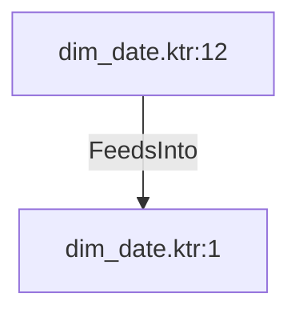

# dim_date.ktr:12 (TransformNode)

## Properties

| Key | Value |
|---|---|
| `columns` | [] |
| `node_type` | Source |
| `object_name` | staging_data_management_mmjja.staging_date |

## Relationships

### FeedsInto

- → dim_date.ktr:1 (`ffe708e2-fe0e-5794-9077-ba76af8635e8`)

## Diagram

## Evidence

- `f304aa97-a43e-5f32-83a2-33d4de7d0c05` — staging_data_management_mmjja.staging_date (confidence: 1.00)
