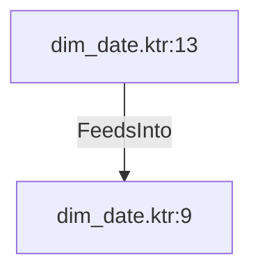

# dim_date.ktr:13 (TransformNode)

## Properties

| Key | Value |
|---|---|
| `columns` | [] |
| `node_type` | Source |
| `object_name` | staging_date |

## Relationships

### FeedsInto

- → dim_date.ktr:9 (`abb32620-4c9c-5a19-9b84-6455af079744`)

## Diagram

## Evidence

- `799e28e1-8063-53dd-802f-621f358b1955` — staging_date (confidence: 1.00)
