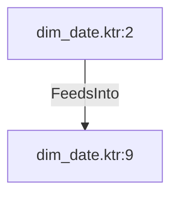

# dim_date.ktr:2 (TransformNode)

## Properties

| Key | Value |
|---|---|
| `node_type` | Unmapped |
| `raw` | <step>
    <name>Constant Values</name>
    <type>DataGrid</type>
    <description/>
    <distribute>Y</distribute>
    <custom_distribution/>
    <copies>1</copies>
    <partitioning>
      <method>none</method>
      <schema_name/>
    </partitioning>
    <fields>
      <field>
        <name>holiday_country_code</name>
        <type>String</type>
        <format/>
        <currency/>
        <decimal/>
        <group/>
        <length>2</length>
        <precision>-1</precision>
        <set_empty_string>N</set_empty_string>
        <field_null_if/>
      </field>
      <field>
        <name>url</name>
        <type>String</type>
        <format/>
        <currency/>
        <decimal/>
        <group/>
        <length>100</length>
        <precision>-1</precision>
        <set_empty_string>N</set_empty_string>
        <field_null_if/>
      </field>
    </fields>
    <data>
      <line>
        <item>ES</item>
        <item>https://date.nager.at/api/v2/publicholidays/</item>
      </line>
    </data>
    <attributes/>
    <cluster_schema/>
    <remotesteps>
      <input>
      </input>
      <output>
      </output>
    </remotesteps>
    <GUI>
      <xloc>48</xloc>
      <yloc>160</yloc>
      <draw>Y</draw>
    </GUI>
  </step> |
| `reason` | unrecognized step type: DataGrid |

## Relationships

### FeedsInto

- → dim_date.ktr:9 (`abb32620-4c9c-5a19-9b84-6455af079744`)

## Diagram

## Evidence

- `87b7b283-1df6-518c-9adc-2f816f7878ef` — <step>
    <name>Constant Values</name>
    <type>DataGrid</type>
    <description/>
    <distribute>Y</distribute>
    <custom_distribution/>
    <copies>1</copies>
    <partitioning>
      <method>none</method>
      <schema_name/>
    </partitioning>
    <fields>
      <field>
        <name>holiday_country_code</name>
        <type>String</type>
        <format/>
        <currency/>
        <decimal/>
        <group/>
        <length>2</length>
        <precision>-1</precision>
        <set_empty_string>N</set_empty_string>
        <field_null_if/>
      </field>
      <field>
        <name>url</name>
        <type>String</type>
        <format/>
        <currency/>
        <decimal/>
        <group/>
        <length>100</length>
        <precision>-1</precision>
        <set_empty_string>N</set_empty_string>
        <field_null_if/>
      </field>
    </fields>
    <data>
      <line>
        <item>ES</item>
        <item>https://date.nager.at/api/v2/publicholidays/</item>
      </line>
    </data>
    <attributes/>
    <cluster_schema/>
    <remotesteps>
      <input>
      </input>
      <output>
      </output>
    </remotesteps>
    <GUI>
      <xloc>48</xloc>
      <yloc>160</yloc>
      <draw>Y</draw>
    </GUI>
  </step> (confidence: 1.00)
