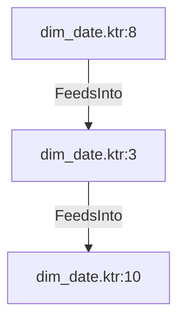

# dim_date.ktr:3 (TransformNode)

## Properties

| Key | Value |
|---|---|
| `node_type` | Unmapped |
| `raw` | <step>
    <name>Format Holiday Values</name>
    <type>ScriptValueMod</type>
    <description/>
    <distribute>Y</distribute>
    <custom_distribution/>
    <copies>1</copies>
    <partitioning>
      <method>none</method>
      <schema_name/>
    </partitioning>
    <compatible>N</compatible>
    <optimizationLevel>9</optimizationLevel>
    <jsScripts>
      <jsScript>
        <jsScript_type>0</jsScript_type>
        <jsScript_name>Script 1</jsScript_name>
        <jsScript_script>var holiday = (calculated_holiday_name != null);
var second_calculated_holiday_name = holiday? calculated_holiday_name : "";
var is_holiday = holiday? 1 : 0;
</jsScript_script>
      </jsScript>
    </jsScripts>
    <fields>
      <field>
        <name>second_calculated_holiday_name</name>
        <rename>second_calculated_holiday_name</rename>
        <type>String</type>
        <length>100</length>
        <precision>-1</precision>
        <replace>N</replace>
      </field>
      <field>
        <name>is_holiday</name>
        <rename>is_holiday</rename>
        <type>Integer</type>
        <length>-1</length>
        <precision>-1</precision>
        <replace>N</replace>
      </field>
      <field>
        <name>holiday</name>
        <rename>holiday</rename>
        <type>Boolean</type>
        <length>-1</length>
        <precision>-1</precision>
        <replace>N</replace>
      </field>
    </fields>
    <attributes/>
    <cluster_schema/>
    <remotesteps>
      <input>
      </input>
      <output>
      </output>
    </remotesteps>
    <GUI>
      <xloc>672</xloc>
      <yloc>48</yloc>
      <draw>Y</draw>
    </GUI>
  </step> |
| `reason` | unrecognized step type: ScriptValueMod |

## Relationships

### FeedsInto

- → dim_date.ktr:10 (`7ee1c0ac-0bbc-5956-bf2b-2ad8be3a4975`)
- ← dim_date.ktr:8 (`3961c4b6-630c-5713-9bc8-387784e6dbee`)

## Diagram

## Evidence

- `5b6d26d6-8ecb-5da7-8a48-734e79c2e6c8` — <step>
    <name>Format Holiday Values</name>
    <type>ScriptValueMod</type>
    <description/>
    <distribute>Y</distribute>
    <custom_distribution/>
    <copies>1</copies>
    <partitioning>
      <method>none</method>
      <schema_name/>
    </partitioning>
    <compatible>N</compatible>
    <optimizationLevel>9</optimizationLevel>
    <jsScripts>
      <jsScript>
        <jsScript_type>0</jsScript_type>
        <jsScript_name>Script 1</jsScript_name>
        <jsScript_script>var holiday = (calculated_holiday_name != null);
var second_calculated_holiday_name = holiday? calculated_holiday_name : "";
var is_holiday = holiday? 1 : 0;
</jsScript_script>
      </jsScript>
    </jsScripts>
    <fields>
      <field>
        <name>second_calculated_holiday_name</name>
        <rename>second_calculated_holiday_name</rename>
        <type>String</type>
        <length>100</length>
        <precision>-1</precision>
        <replace>N</replace>
      </field>
      <field>
        <name>is_holiday</name>
        <rename>is_holiday</rename>
        <type>Integer</type>
        <length>-1</length>
        <precision>-1</precision>
        <replace>N</replace>
      </field>
      <field>
        <name>holiday</name>
        <rename>holiday</rename>
        <type>Boolean</type>
        <length>-1</length>
        <precision>-1</precision>
        <replace>N</replace>
      </field>
    </fields>
    <attributes/>
    <cluster_schema/>
    <remotesteps>
      <input>
      </input>
      <output>
      </output>
    </remotesteps>
    <GUI>
      <xloc>672</xloc>
      <yloc>48</yloc>
      <draw>Y</draw>
    </GUI>
  </step> (confidence: 1.00)
