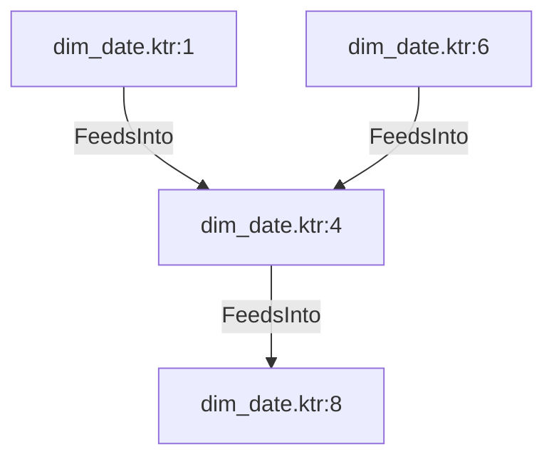

# dim_date.ktr:4 (TransformNode)

## Properties

| Key | Value |
|---|---|
| `join_kind` | Left |
| `keys` | [] |
| `left` | 0 |
| `node_type` | Join |
| `right` | 0 |

## Relationships

### FeedsInto

- → dim_date.ktr:8 (`3961c4b6-630c-5713-9bc8-387784e6dbee`)
- ← dim_date.ktr:1 (`ffe708e2-fe0e-5794-9077-ba76af8635e8`)
- ← dim_date.ktr:6 (`6058cd8d-9cd6-5654-a648-9d1249282de0`)

## Diagram

## Evidence

- `46f48f62-07d0-5956-b141-8704c323745e` — Left JOIN ON [] (confidence: 1.00)
