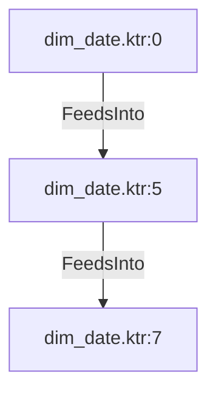

# dim_date.ktr:5 (TransformNode)

## Properties

| Key | Value |
|---|---|
| `node_type` | Unmapped |
| `raw` | <step>
    <name>Holidays API</name>
    <type>Rest</type>
    <description/>
    <distribute>Y</distribute>
    <custom_distribution/>
    <copies>1</copies>
    <partitioning>
      <method>none</method>
      <schema_name/>
    </partitioning>
    <applicationType>JSON</applicationType>
    <method>GET</method>
    <url>https://date.nager.at/api/v2/publicholidays/2020/es</url>
    <urlInField>Y</urlInField>
    <dynamicMethod>N</dynamicMethod>
    <methodFieldName/>
    <urlField>api_url</urlField>
    <bodyField/>
    <httpLogin/>
    <httpPassword>Encrypted </httpPassword>
    <proxyHost/>
    <proxyPort/>
    <preemptive>N</preemptive>
    <trustStoreFile/>
    <trustStorePassword>Encrypted </trustStorePassword>
    <headers>
      </headers>
    <parameters>
      </parameters>
    <matrixParameters>
      </matrixParameters>
    <result>
      <name>result</name>
      <code/>
      <response_time/>
      <response_header/>
    </result>
    <attributes/>
    <cluster_schema/>
    <remotesteps>
      <input>
      </input>
      <output>
      </output>
    </remotesteps>
    <GUI>
      <xloc>288</xloc>
      <yloc>224</yloc>
      <draw>Y</draw>
    </GUI>
  </step> |
| `reason` | unrecognized step type: Rest |

## Relationships

### FeedsInto

- → dim_date.ktr:7 (`fe55ff87-f4fc-57b1-9fa8-7d4d3398f1a7`)
- ← dim_date.ktr:0 (`8b3e1814-e9cc-578f-894f-6b088e69a4aa`)

## Diagram

## Evidence

- `fc738899-9409-5322-8922-37e056c68f9c` — <step>
    <name>Holidays API</name>
    <type>Rest</type>
    <description/>
    <distribute>Y</distribute>
    <custom_distribution/>
    <copies>1</copies>
    <partitioning>
      <method>none</method>
      <schema_name/>
    </partitioning>
    <applicationType>JSON</applicationType>
    <method>GET</method>
    <url>https://date.nager.at/api/v2/publicholidays/2020/es</url>
    <urlInField>Y</urlInField>
    <dynamicMethod>N</dynamicMethod>
    <methodFieldName/>
    <urlField>api_url</urlField>
    <bodyField/>
    <httpLogin/>
    <httpPassword>Encrypted </httpPassword>
    <proxyHost/>
    <proxyPort/>
    <preemptive>N</preemptive>
    <trustStoreFile/>
    <trustStorePassword>Encrypted </trustStorePassword>
    <headers>
      </headers>
    <parameters>
      </parameters>
    <matrixParameters>
      </matrixParameters>
    <result>
      <name>result</name>
      <code/>
      <response_time/>
      <response_header/>
    </result>
    <attributes/>
    <cluster_schema/>
    <remotesteps>
      <input>
      </input>
      <output>
      </output>
    </remotesteps>
    <GUI>
      <xloc>288</xloc>
      <yloc>224</yloc>
      <draw>Y</draw>
    </GUI>
  </step> (confidence: 1.00)
