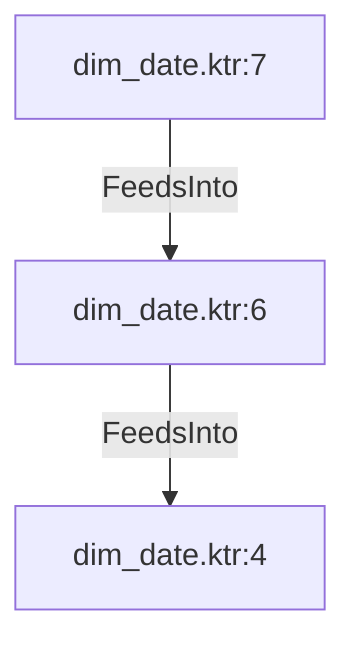

# dim_date.ktr:6 (TransformNode)

## Properties

| Key | Value |
|---|---|
| `excerpt` | global = 'Y' |
| `node_type` | Filter |

## Relationships

### FeedsInto

- → dim_date.ktr:4 (`75430eb0-f4fe-5215-ad6c-1c4734756c60`)
- ← dim_date.ktr:7 (`fe55ff87-f4fc-57b1-9fa8-7d4d3398f1a7`)

## Diagram

## Evidence

- `d226e73d-d0ff-5d70-8a10-b8343ccc89e9` — global = 'Y' (confidence: 1.00)
