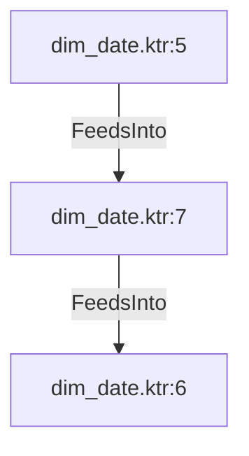

# dim_date.ktr:7 (TransformNode)

## Properties

| Key | Value |
|---|---|
| `node_type` | Unmapped |
| `raw` | <step>
    <name>Parse JSON holiday</name>
    <type>JsonInput</type>
    <description/>
    <distribute>Y</distribute>
    <custom_distribution/>
    <copies>1</copies>
    <partitioning>
      <method>none</method>
      <schema_name/>
    </partitioning>
    <include>N</include>
    <include_field/>
    <rownum>N</rownum>
    <addresultfile>N</addresultfile>
    <readurl>N</readurl>
    <removeSourceField>N</removeSourceField>
    <IsIgnoreEmptyFile>N</IsIgnoreEmptyFile>
    <doNotFailIfNoFile>Y</doNotFailIfNoFile>
    <ignoreMissingPath>Y</ignoreMissingPath>
    <defaultPathLeafToNull>Y</defaultPathLeafToNull>
    <rownum_field/>
    <file>
      <name/>
      <filemask/>
      <exclude_filemask/>
      <file_required>N</file_required>
      <include_subfolders>N</include_subfolders>
    </file>
    <fields>
      <field>
        <name>date</name>
        <path>$..date</path>
        <type>Date</type>
        <format>yyyy-MM-dd</format>
        <currency/>
        <decimal/>
        <group/>
        <length>-1</length>
        <precision>-1</precision>
        <trim_type>none</trim_type>
        <repeat>N</repeat>
      </field>
      <field>
        <name>local_name</name>
        <path>$..localName</path>
        <type>String</type>
        <format/>
        <currency/>
        <decimal/>
        <group/>
        <length>-1</length>
        <precision>-1</precision>
        <trim_type>none</trim_type>
        <repeat>N</repeat>
      </field>
      <field>
        <name>name</name>
        <path>$..name</path>
        <type>String</type>
        <format/>
        <currency/>
        <decimal/>
        <group/>
        <length>-1</length>
        <precision>-1</precision>
        <trim_type>none</trim_type>
        <repeat>N</repeat>
      </field>
      <field>
        <name>global</name>
        <path>$..global</path>
        <type>Boolean</type>
        <format/>
        <currency/>
        <decimal/>
        <group/>
        <length>-1</length>
        <precision>-1</precision>
        <trim_type>none</trim_type>
        <repeat>N</repeat>
      </field>
    </fields>
    <limit>0</limit>
    <IsInFields>Y</IsInFields>
    <IsAFile>N</IsAFile>
    <valueField>result</valueField>
    <shortFileFieldName/>
    <pathFieldName/>
    <hiddenFieldName/>
    <lastModificationTimeFieldName/>
    <uriNameFieldName/>
    <rootUriNameFieldName/>
    <extensionFieldName/>
    <sizeFieldName/>
    <attributes/>
    <cluster_schema/>
    <remotesteps>
      <input>
      </input>
      <output>
      </output>
    </remotesteps>
    <GUI>
      <xloc>432</xloc>
      <yloc>224</yloc>
      <draw>Y</draw>
    </GUI>
  </step> |
| `reason` | unrecognized step type: JsonInput |

## Relationships

### FeedsInto

- → dim_date.ktr:6 (`6058cd8d-9cd6-5654-a648-9d1249282de0`)
- ← dim_date.ktr:5 (`d0a86255-f80e-5729-aff0-b5f77fe8ed2a`)

## Diagram

## Evidence

- `e0246899-d5d3-5ec8-a63a-f696211e8b7e` — <step>
    <name>Parse JSON holiday</name>
    <type>JsonInput</type>
    <description/>
    <distribute>Y</distribute>
    <custom_distribution/>
    <copies>1</copies>
    <partitioning>
      <method>none</method>
      <schema_name/>
    </partitioning>
    <include>N</include>
    <include_field/>
    <rownum>N</rownum>
    <addresultfile>N</addresultfile>
    <readurl>N</readurl>
    <removeSourceField>N</removeSourceField>
    <IsIgnoreEmptyFile>N</IsIgnoreEmptyFile>
    <doNotFailIfNoFile>Y</doNotFailIfNoFile>
    <ignoreMissingPath>Y</ignoreMissingPath>
    <defaultPathLeafToNull>Y</defaultPathLeafToNull>
    <rownum_field/>
    <file>
      <name/>
      <filemask/>
      <exclude_filemask/>
      <file_required>N</file_required>
      <include_subfolders>N</include_subfolders>
    </file>
    <fields>
      <field>
        <name>date</name>
        <path>$..date</path>
        <type>Date</type>
        <format>yyyy-MM-dd</format>
        <currency/>
        <decimal/>
        <group/>
        <length>-1</length>
        <precision>-1</precision>
        <trim_type>none</trim_type>
        <repeat>N</repeat>
      </field>
      <field>
        <name>local_name</name>
        <path>$..localName</path>
        <type>String</type>
        <format/>
        <currency/>
        <decimal/>
        <group/>
        <length>-1</length>
        <precision>-1</precision>
        <trim_type>none</trim_type>
        <repeat>N</repeat>
      </field>
      <field>
        <name>name</name>
        <path>$..name</path>
        <type>String</type>
        <format/>
        <currency/>
        <decimal/>
        <group/>
        <length>-1</length>
        <precision>-1</precision>
        <trim_type>none</trim_type>
        <repeat>N</repeat>
      </field>
      <field>
        <name>global</name>
        <path>$..global</path>
        <type>Boolean</type>
        <format/>
        <currency/>
        <decimal/>
        <group/>
        <length>-1</length>
        <precision>-1</precision>
        <trim_type>none</trim_type>
        <repeat>N</repeat>
      </field>
    </fields>
    <limit>0</limit>
    <IsInFields>Y</IsInFields>
    <IsAFile>N</IsAFile>
    <valueField>result</valueField>
    <shortFileFieldName/>
    <pathFieldName/>
    <hiddenFieldName/>
    <lastModificationTimeFieldName/>
    <uriNameFieldName/>
    <rootUriNameFieldName/>
    <extensionFieldName/>
    <sizeFieldName/>
    <attributes/>
    <cluster_schema/>
    <remotesteps>
      <input>
      </input>
      <output>
      </output>
    </remotesteps>
    <GUI>
      <xloc>432</xloc>
      <yloc>224</yloc>
      <draw>Y</draw>
    </GUI>
  </step> (confidence: 1.00)
