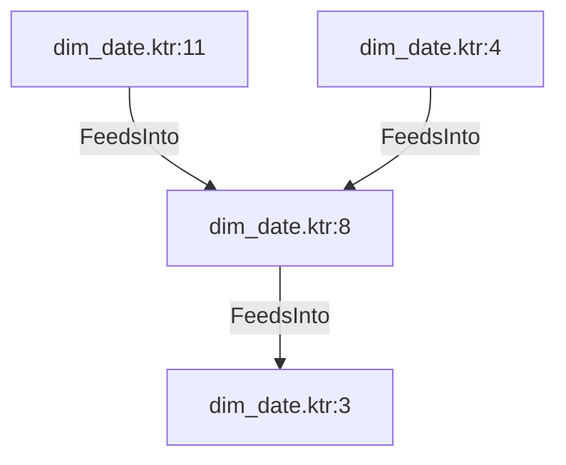

# dim_date.ktr:8 (TransformNode)

## Properties

| Key | Value |
|---|---|
| `join_kind` | Left |
| `keys` | [] |
| `left` | 0 |
| `node_type` | Join |
| `right` | 0 |

## Relationships

### FeedsInto

- → dim_date.ktr:3 (`d31a1a57-590f-5b04-af4f-6d7993063e05`)
- ← dim_date.ktr:11 (`1b8fe8b4-cd48-5556-9840-9a0a32a6d286`)
- ← dim_date.ktr:4 (`75430eb0-f4fe-5215-ad6c-1c4734756c60`)

## Diagram

## Evidence

- `b3298834-1c0d-5f47-a398-8edf459d3398` — Left JOIN ON [] (confidence: 1.00)
