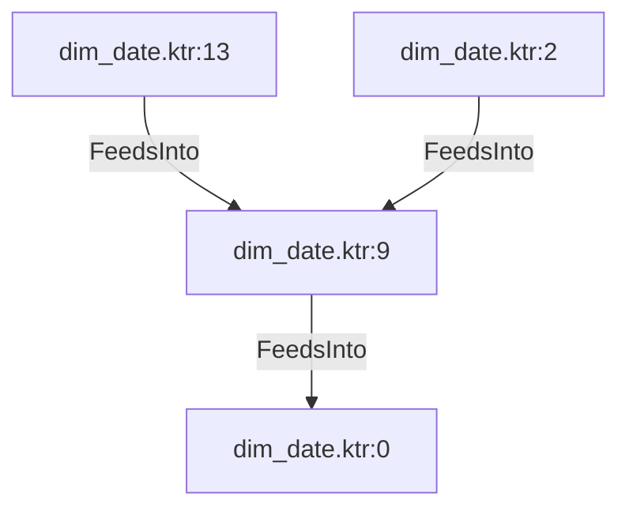

# dim_date.ktr:9 (TransformNode)

## Properties

| Key | Value |
|---|---|
| `node_type` | Unmapped |
| `raw` | <step>
    <name>URL by Years</name>
    <type>JoinRows</type>
    <description/>
    <distribute>Y</distribute>
    <custom_distribution/>
    <copies>1</copies>
    <partitioning>
      <method>none</method>
      <schema_name/>
    </partitioning>
    <directory>%%java.io.tmpdir%%</directory>
    <prefix>out</prefix>
    <cache_size>500</cache_size>
    <main>staging_date_years</main>
    <compare>
      <condition>
        <negated>N</negated>
        <leftvalue/>
        <function>=</function>
        <rightvalue/>
      </condition>
    </compare>
    <attributes/>
    <cluster_schema/>
    <remotesteps>
      <input>
      </input>
      <output>
      </output>
    </remotesteps>
    <GUI>
      <xloc>208</xloc>
      <yloc>112</yloc>
      <draw>Y</draw>
    </GUI>
  </step> |
| `reason` | unrecognized step type: JoinRows |

## Relationships

### FeedsInto

- → dim_date.ktr:0 (`8b3e1814-e9cc-578f-894f-6b088e69a4aa`)
- ← dim_date.ktr:13 (`25d5931f-2174-5ad0-b6cf-a7ebe20b6679`)
- ← dim_date.ktr:2 (`ec6714fe-2f9d-5897-8d94-99bf3a0db639`)

## Diagram

## Evidence

- `32d33411-e455-5632-984d-82189845c5ea` — <step>
    <name>URL by Years</name>
    <type>JoinRows</type>
    <description/>
    <distribute>Y</distribute>
    <custom_distribution/>
    <copies>1</copies>
    <partitioning>
      <method>none</method>
      <schema_name/>
    </partitioning>
    <directory>%%java.io.tmpdir%%</directory>
    <prefix>out</prefix>
    <cache_size>500</cache_size>
    <main>staging_date_years</main>
    <compare>
      <condition>
        <negated>N</negated>
        <leftvalue/>
        <function>=</function>
        <rightvalue/>
      </condition>
    </compare>
    <attributes/>
    <cluster_schema/>
    <remotesteps>
      <input>
      </input>
      <output>
      </output>
    </remotesteps>
    <GUI>
      <xloc>208</xloc>
      <yloc>112</yloc>
      <draw>Y</draw>
    </GUI>
  </step> (confidence: 1.00)
