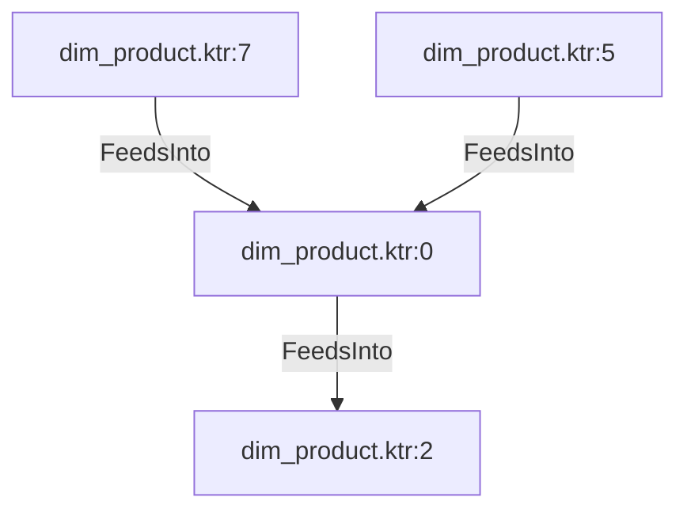

# dim_product.ktr:0 (TransformNode)

## Properties

| Key | Value |
|---|---|
| `join_kind` | Left |
| `keys` | [] |
| `left` | 0 |
| `node_type` | Join |
| `right` | 0 |

## Relationships

### FeedsInto

- → dim_product.ktr:2 (`1ff1a6fd-c5d3-52a5-9df0-4395359ad6cd`)
- ← dim_product.ktr:7 (`c9b6589c-9f9b-52e8-9c1e-62aa262b403c`)
- ← dim_product.ktr:5 (`69ad0e58-31bb-5d74-9453-b33d825b6595`)

## Diagram

## Evidence

- `90d1525f-09e2-5532-bbcb-536263553edf` — Left JOIN ON [] (confidence: 1.00)
