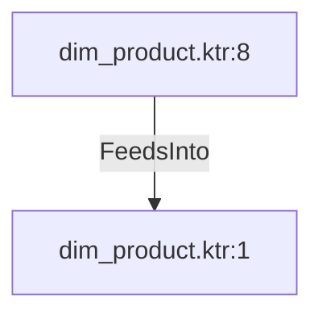

# dim_product.ktr:1 (TransformNode)

## Properties

| Key | Value |
|---|---|
| `node_type` | Unmapped |
| `raw` | <step>
    <name>Insert / Update dim_product</name>
    <type>DimensionLookup</type>
    <description/>
    <distribute>Y</distribute>
    <custom_distribution/>
    <copies>1</copies>
    <partitioning>
      <method>none</method>
      <schema_name/>
    </partitioning>
    <schema>eae_data_management_mmjja</schema>
    <table>dim_product</table>
    <connection>Local-MySQL</connection>
    <commit>100</commit>
    <update>Y</update>
    <fields>
      <key>
        <name>ProductID</name>
        <lookup>product_id</lookup>
      </key>
      <date>
        <name/>
        <from>start_date</from>
        <to>end_date</to>
      </date>
      <field>
        <name>ProductNumber</name>
        <lookup>product_number</lookup>
        <update>Insert</update>
      </field>
      <field>
        <name>Name</name>
        <lookup>product_name</lookup>
        <update>Insert</update>
      </field>
      <field>
        <name>MakeFlag</name>
        <lookup>make_flag</lookup>
        <update>Insert</update>
      </field>
      <field>
        <name>FinishedGoodsFlag</name>
        <lookup>finished_goods_flag</lookup>
        <update>Insert</update>
      </field>
      <field>
        <name>Color</name>
        <lookup>color</lookup>
        <update>Insert</update>
      </field>
      <field>
        <name>Size</name>
        <lookup>size</lookup>
        <update>Insert</update>
      </field>
      <field>
        <name>SizeUnitMeasureCode</name>
        <lookup>size_unit_measure_code</lookup>
        <update>Insert</update>
      </field>
      <field>
        <name>Weight</name>
        <lookup>weight</lookup>
        <update>Insert</update>
      </field>
      <field>
        <name>WeightUnitMeasureCode</name>
        <lookup>weight_unit_measure_code</lookup>
        <update>Insert</update>
      </field>
      <field>
        <name>ProductLine</name>
        <lookup>product_line_code</lookup>
        <update>Insert</update>
      </field>
      <field>
        <name>Style</name>
        <lookup>style</lookup>
        <update>Insert</update>
      </field>
      <field>
        <name>ProductSubcategoryID</name>
        <lookup>product_subcategory_id</lookup>
        <update>Insert</update>
      </field>
      <field>
        <name>ProductSubCategoryName</name>
        <lookup>product_subcategory_name</lookup>
        <update>Insert</update>
      </field>
      <field>
        <name>ProductCategoryId</name>
        <lookup>product_category_id</lookup>
        <update>Insert</update>
      </field>
      <field>
        <name>ProductCategoryName</name>
        <lookup>product_category_name</lookup>
        <update>Insert</update>
      </field>
      <field>
        <name>ProductModelID</name>
        <lookup>product_model_id</lookup>
        <update>Insert</update>
      </field>
      <field>
        <name>ProductModelName</name>
        <lookup>product_model_name</lookup>
        <update>Insert</update>
      </field>
      <field>
        <name>Class</name>
        <lookup>class_code</lookup>
        <update>Insert</update>
      </field>
      <return>
        <name>dim_product_id</name>
        <rename/>
        <creation_method>tablemax</creation_method>
        <use_autoinc>N</use_autoinc>
        <version>version_number</version>
      </return>
    </fields>
    <sequence/>
    <min_year>1900</min_year>
    <max_year>2199</max_year>
    <cache_size>5000</cache_size>
    <preload_cache>N</preload_cache>
    <use_start_date_alternative>N</use_start_date_alternative>
    <start_date_alternative>none</start_date_alternative>
    <start_date_field_name/>
    <useBatch>N</useBatch>
    <attributes/>
    <cluster_schema/>
    <remotesteps>
      <input>
      </input>
      <output>
      </output>
    </remotesteps>
    <GUI>
      <xloc>720</xloc>
      <yloc>128</yloc>
      <draw>Y</draw>
    </GUI>
  </step> |
| `reason` | unrecognized step type: DimensionLookup |

## Relationships

### FeedsInto

- ← dim_product.ktr:8 (`44d97c2a-0242-5444-ad46-9d9c6217899c`)

## Diagram

## Evidence

- `61859631-3b02-5dda-8762-4becc6a32440` — <step>
    <name>Insert / Update dim_product</name>
    <type>DimensionLookup</type>
    <description/>
    <distribute>Y</distribute>
    <custom_distribution/>
    <copies>1</copies>
    <partitioning>
      <method>none</method>
      <schema_name/>
    </partitioning>
    <schema>eae_data_management_mmjja</schema>
    <table>dim_product</table>
    <connection>Local-MySQL</connection>
    <commit>100</commit>
    <update>Y</update>
    <fields>
      <key>
        <name>ProductID</name>
        <lookup>product_id</lookup>
      </key>
      <date>
        <name/>
        <from>start_date</from>
        <to>end_date</to>
      </date>
      <field>
        <name>ProductNumber</name>
        <lookup>product_number</lookup>
        <update>Insert</update>
      </field>
      <field>
        <name>Name</name>
        <lookup>product_name</lookup>
        <update>Insert</update>
      </field>
      <field>
        <name>MakeFlag</name>
        <lookup>make_flag</lookup>
        <update>Insert</update>
      </field>
      <field>
        <name>FinishedGoodsFlag</name>
        <lookup>finished_goods_flag</lookup>
        <update>Insert</update>
      </field>
      <field>
        <name>Color</name>
        <lookup>color</lookup>
        <update>Insert</update>
      </field>
      <field>
        <name>Size</name>
        <lookup>size</lookup>
        <update>Insert</update>
      </field>
      <field>
        <name>SizeUnitMeasureCode</name>
        <lookup>size_unit_measure_code</lookup>
        <update>Insert</update>
      </field>
      <field>
        <name>Weight</name>
        <lookup>weight</lookup>
        <update>Insert</update>
      </field>
      <field>
        <name>WeightUnitMeasureCode</name>
        <lookup>weight_unit_measure_code</lookup>
        <update>Insert</update>
      </field>
      <field>
        <name>ProductLine</name>
        <lookup>product_line_code</lookup>
        <update>Insert</update>
      </field>
      <field>
        <name>Style</name>
        <lookup>style</lookup>
        <update>Insert</update>
      </field>
      <field>
        <name>ProductSubcategoryID</name>
        <lookup>product_subcategory_id</lookup>
        <update>Insert</update>
      </field>
      <field>
        <name>ProductSubCategoryName</name>
        <lookup>product_subcategory_name</lookup>
        <update>Insert</update>
      </field>
      <field>
        <name>ProductCategoryId</name>
        <lookup>product_category_id</lookup>
        <update>Insert</update>
      </field>
      <field>
        <name>ProductCategoryName</name>
        <lookup>product_category_name</lookup>
        <update>Insert</update>
      </field>
      <field>
        <name>ProductModelID</name>
        <lookup>product_model_id</lookup>
        <update>Insert</update>
      </field>
      <field>
        <name>ProductModelName</name>
        <lookup>product_model_name</lookup>
        <update>Insert</update>
      </field>
      <field>
        <name>Class</name>
        <lookup>class_code</lookup>
        <update>Insert</update>
      </field>
      <return>
        <name>dim_product_id</name>
        <rename/>
        <creation_method>tablemax</creation_method>
        <use_autoinc>N</use_autoinc>
        <version>version_number</version>
      </return>
    </fields>
    <sequence/>
    <min_year>1900</min_year>
    <max_year>2199</max_year>
    <cache_size>5000</cache_size>
    <preload_cache>N</preload_cache>
    <use_start_date_alternative>N</use_start_date_alternative>
    <start_date_alternative>none</start_date_alternative>
    <start_date_field_name/>
    <useBatch>N</useBatch>
    <attributes/>
    <cluster_schema/>
    <remotesteps>
      <input>
      </input>
      <output>
      </output>
    </remotesteps>
    <GUI>
      <xloc>720</xloc>
      <yloc>128</yloc>
      <draw>Y</draw>
    </GUI>
  </step> (confidence: 1.00)
