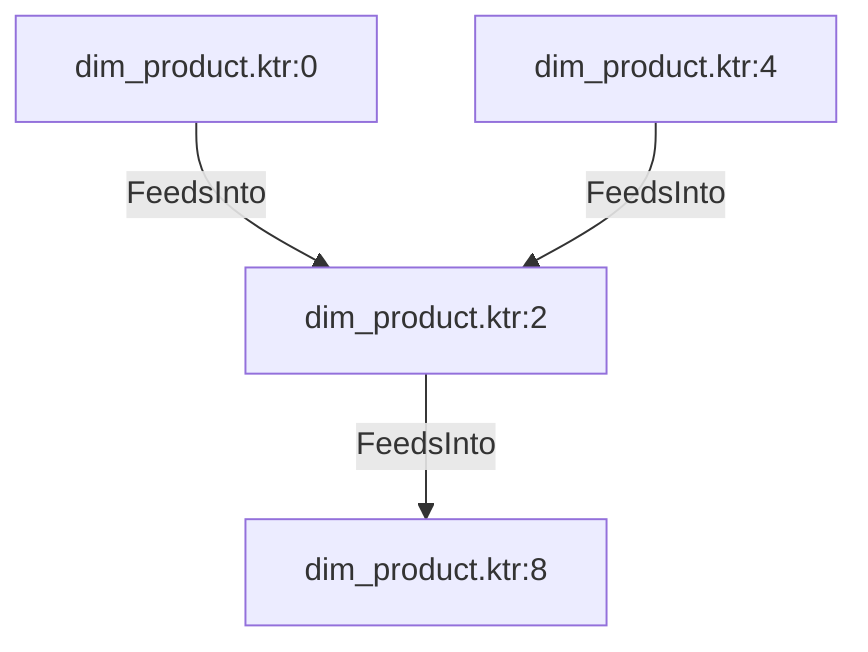

# dim_product.ktr:2 (TransformNode)

## Properties

| Key | Value |
|---|---|
| `join_kind` | Left |
| `keys` | [] |
| `left` | 0 |
| `node_type` | Join |
| `right` | 0 |

## Relationships

### FeedsInto

- → dim_product.ktr:8 (`44d97c2a-0242-5444-ad46-9d9c6217899c`)
- ← dim_product.ktr:0 (`50aa0203-68c2-51a6-bc06-e60c958ab198`)
- ← dim_product.ktr:4 (`366b1251-1d44-527b-8d7d-e81c8b3d5e7f`)

## Diagram

## Evidence

- `a880b54a-d58d-5c31-806f-47cf027dc962` — Left JOIN ON [] (confidence: 1.00)
