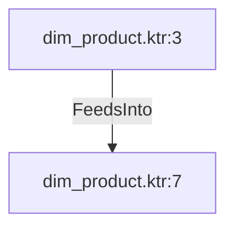

# dim_product.ktr:3 (TransformNode)

## Properties

| Key | Value |
|---|---|
| `columns` | [] |
| `node_type` | Source |
| `object_name` | [Production].[Product] |

## Relationships

### FeedsInto

- → dim_product.ktr:7 (`c9b6589c-9f9b-52e8-9c1e-62aa262b403c`)

## Diagram

## Evidence

- `7eecea81-56ed-5279-8ece-864871d00e83` — [Production].[Product] (confidence: 1.00)
