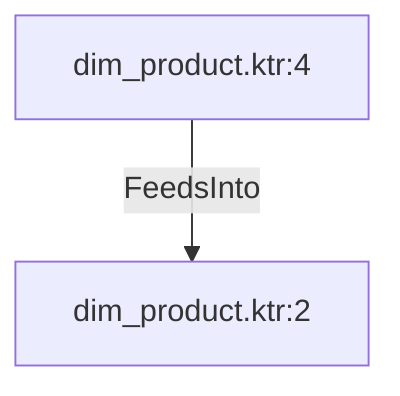

# dim_product.ktr:4 (TransformNode)

## Properties

| Key | Value |
|---|---|
| `columns` | [] |
| `node_type` | Source |
| `object_name` | [Production].[ProductModel] |

## Relationships

### FeedsInto

- → dim_product.ktr:2 (`1ff1a6fd-c5d3-52a5-9df0-4395359ad6cd`)

## Diagram

## Evidence

- `5ccf575d-fd9b-5b5f-96a7-f16f7501faf6` — [Production].[ProductModel] (confidence: 1.00)
