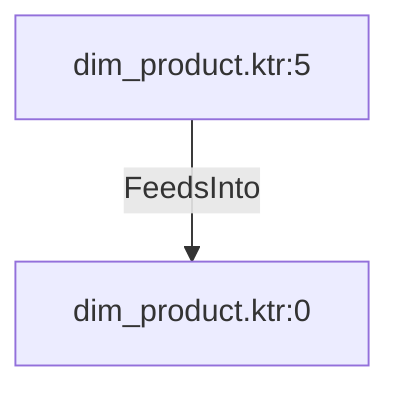

# dim_product.ktr:5 (TransformNode)

## Properties

| Key | Value |
|---|---|
| `columns` | [] |
| `node_type` | Source |
| `object_name` | [Production].[ProductCategory] |

## Relationships

### FeedsInto

- → dim_product.ktr:0 (`50aa0203-68c2-51a6-bc06-e60c958ab198`)

## Diagram

## Evidence

- `dca24d96-8f22-5c3d-ace1-c176660eb912` — [Production].[ProductCategory] (confidence: 1.00)
