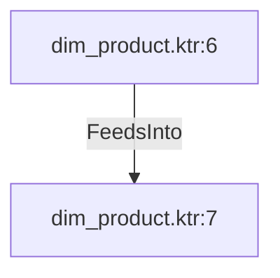

# dim_product.ktr:6 (TransformNode)

## Properties

| Key | Value |
|---|---|
| `columns` | [] |
| `node_type` | Source |
| `object_name` | [Production].[ProductSubcategory] |

## Relationships

### FeedsInto

- → dim_product.ktr:7 (`c9b6589c-9f9b-52e8-9c1e-62aa262b403c`)

## Diagram

## Evidence

- `4919741b-b552-5f49-aa49-0f4d06af6dd2` — [Production].[ProductSubcategory] (confidence: 1.00)
