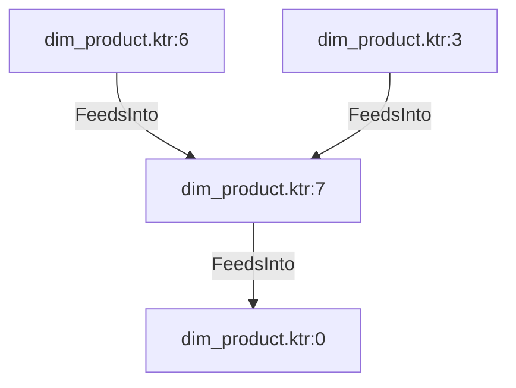

# dim_product.ktr:7 (TransformNode)

## Properties

| Key | Value |
|---|---|
| `join_kind` | Left |
| `keys` | [] |
| `left` | 0 |
| `node_type` | Join |
| `right` | 0 |

## Relationships

### FeedsInto

- → dim_product.ktr:0 (`50aa0203-68c2-51a6-bc06-e60c958ab198`)
- ← dim_product.ktr:6 (`9fd8545b-6ba6-50be-8f9a-a079b58b99db`)
- ← dim_product.ktr:3 (`e14e3f0c-7ebc-53ee-a94a-9ae8dfaa6ea4`)

## Diagram

## Evidence

- `e1470855-f85a-5b0e-b0ba-3be5c1a0703b` — Left JOIN ON [] (confidence: 1.00)
