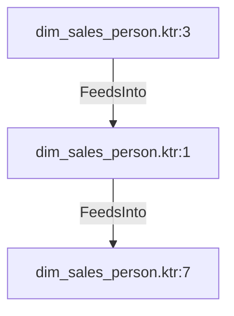

# dim_sales_person.ktr:1 (TransformNode)

## Properties

| Key | Value |
|---|---|
| `node_type` | Unmapped |
| `raw` | <step>
    <name>Select values</name>
    <type>SelectValues</type>
    <description/>
    <distribute>Y</distribute>
    <custom_distribution/>
    <copies>1</copies>
    <partitioning>
      <method>none</method>
      <schema_name/>
    </partitioning>
    <fields>
      <field>
        <name>BusinessEntityID</name>
        <rename>sales_person_entity_id</rename>
      </field>
      <field>
        <name>person_title</name>
        <rename>person_title</rename>
      </field>
      <field>
        <name>dim_sales_person_id</name>
        <rename>dim_sales_person_id</rename>
      </field>
      <field>
        <name>person_first_name</name>
        <rename>person_first_name</rename>
      </field>
      <field>
        <name>person_last_name</name>
        <rename>person_last_name</rename>
      </field>
      <field>
        <name>person_middle_name</name>
        <rename>person_middle_name</rename>
      </field>
      <field>
        <name>person_suffix</name>
        <rename>person_suffix</rename>
      </field>
      <field>
        <name>employee_job_title</name>
        <rename>employee_job_title</rename>
      </field>
      <field>
        <name>employee_gender</name>
        <rename>employee_gender_code</rename>
      </field>
      <field>
        <name>employee_hire_date</name>
        <rename>employee_hire_date</rename>
      </field>
      <field>
        <name>employee_martial_status</name>
        <rename>employee_marital_status</rename>
      </field>
      <field>
        <name>employee_national_id_number</name>
        <rename>employee_national_id_number</rename>
      </field>
      <select_unspecified>N</select_unspecified>
    </fields>
    <attributes/>
    <cluster_schema/>
    <remotesteps>
      <input>
      </input>
      <output>
      </output>
    </remotesteps>
    <GUI>
      <xloc>592</xloc>
      <yloc>160</yloc>
      <draw>Y</draw>
    </GUI>
  </step> |
| `reason` | unrecognized step type: SelectValues |

## Relationships

### FeedsInto

- → dim_sales_person.ktr:7 (`bf9b4b64-3cab-5c26-8eb8-b3d8a83b34c3`)
- ← dim_sales_person.ktr:3 (`30af066c-2584-50ab-b1d2-e8b9a8bba955`)

## Diagram

## Evidence

- `bacdcf73-635a-52cd-b709-c4bb007e644a` — <step>
    <name>Select values</name>
    <type>SelectValues</type>
    <description/>
    <distribute>Y</distribute>
    <custom_distribution/>
    <copies>1</copies>
    <partitioning>
      <method>none</method>
      <schema_name/>
    </partitioning>
    <fields>
      <field>
        <name>BusinessEntityID</name>
        <rename>sales_person_entity_id</rename>
      </field>
      <field>
        <name>person_title</name>
        <rename>person_title</rename>
      </field>
      <field>
        <name>dim_sales_person_id</name>
        <rename>dim_sales_person_id</rename>
      </field>
      <field>
        <name>person_first_name</name>
        <rename>person_first_name</rename>
      </field>
      <field>
        <name>person_last_name</name>
        <rename>person_last_name</rename>
      </field>
      <field>
        <name>person_middle_name</name>
        <rename>person_middle_name</rename>
      </field>
      <field>
        <name>person_suffix</name>
        <rename>person_suffix</rename>
      </field>
      <field>
        <name>employee_job_title</name>
        <rename>employee_job_title</rename>
      </field>
      <field>
        <name>employee_gender</name>
        <rename>employee_gender_code</rename>
      </field>
      <field>
        <name>employee_hire_date</name>
        <rename>employee_hire_date</rename>
      </field>
      <field>
        <name>employee_martial_status</name>
        <rename>employee_marital_status</rename>
      </field>
      <field>
        <name>employee_national_id_number</name>
        <rename>employee_national_id_number</rename>
      </field>
      <select_unspecified>N</select_unspecified>
    </fields>
    <attributes/>
    <cluster_schema/>
    <remotesteps>
      <input>
      </input>
      <output>
      </output>
    </remotesteps>
    <GUI>
      <xloc>592</xloc>
      <yloc>160</yloc>
      <draw>Y</draw>
    </GUI>
  </step> (confidence: 1.00)
