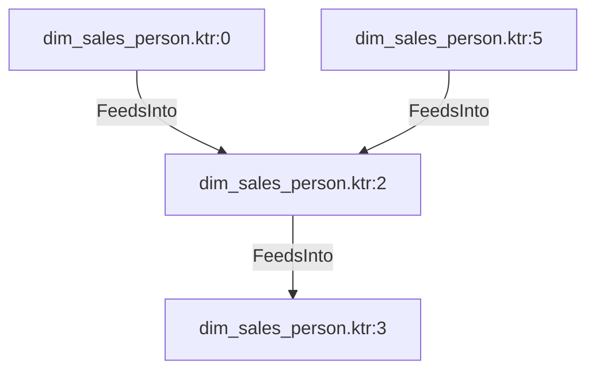

# dim_sales_person.ktr:2 (TransformNode)

## Properties

| Key | Value |
|---|---|
| `join_kind` | Left |
| `keys` | [] |
| `left` | 0 |
| `node_type` | Join |
| `right` | 0 |

## Relationships

### FeedsInto

- → dim_sales_person.ktr:3 (`30af066c-2584-50ab-b1d2-e8b9a8bba955`)
- ← dim_sales_person.ktr:0 (`d3d9a08d-a353-51f5-8945-91da2a42146d`)
- ← dim_sales_person.ktr:5 (`3f22db9f-58c3-53a7-8ba5-7dcdb5388b76`)

## Diagram

## Evidence

- `ce462a91-e30d-5749-974f-75937cf6ad79` — Left JOIN ON [] (confidence: 1.00)
