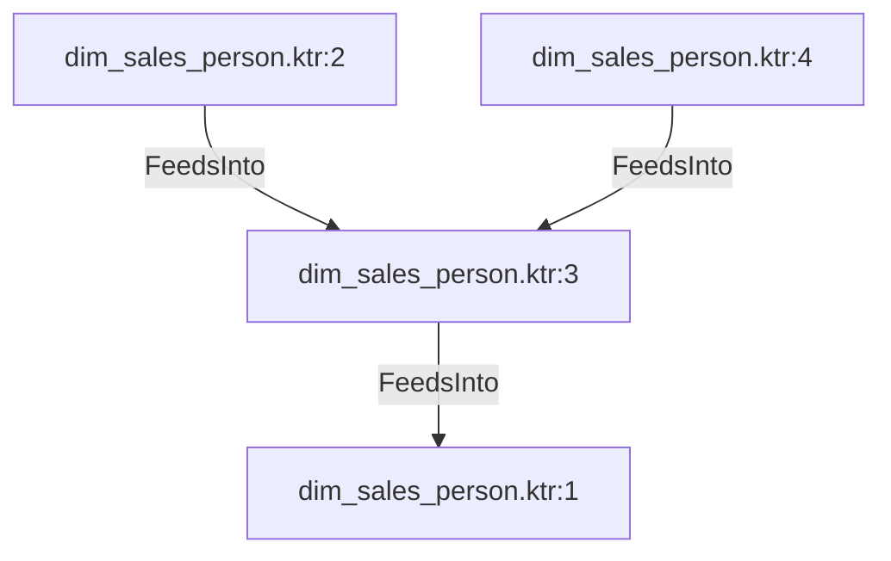

# dim_sales_person.ktr:3 (TransformNode)

## Properties

| Key | Value |
|---|---|
| `join_kind` | Left |
| `keys` | [] |
| `left` | 0 |
| `node_type` | Join |
| `right` | 0 |

## Relationships

### FeedsInto

- → dim_sales_person.ktr:1 (`805f3826-5f37-5e0e-955c-94101dd972dc`)
- ← dim_sales_person.ktr:2 (`e2f19a19-f1ce-55d6-bdfa-c60c9cd35e5c`)
- ← dim_sales_person.ktr:4 (`be2f1841-af6a-5f80-9520-f8d20f0cf6c6`)

## Diagram

## Evidence

- `59f0a65d-6638-52bd-9db8-fac3e729f8f1` — Left JOIN ON [] (confidence: 1.00)
