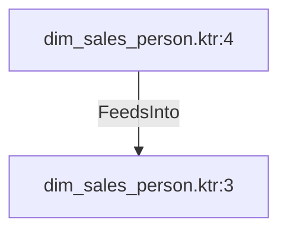

# dim_sales_person.ktr:4 (TransformNode)

## Properties

| Key | Value |
|---|---|
| `columns` | [] |
| `node_type` | Source |
| `object_name` | HumanResources.Employee |

## Relationships

### FeedsInto

- → dim_sales_person.ktr:3 (`30af066c-2584-50ab-b1d2-e8b9a8bba955`)

## Diagram

## Evidence

- `2435097e-cfd9-51e4-bedc-291c24b3837c` — HumanResources.Employee (confidence: 1.00)
