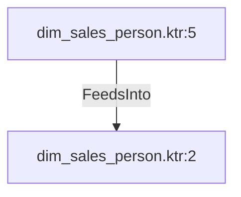

# dim_sales_person.ktr:5 (TransformNode)

## Properties

| Key | Value |
|---|---|
| `columns` | [] |
| `node_type` | Source |
| `object_name` | Person.Person |

## Relationships

### FeedsInto

- → dim_sales_person.ktr:2 (`e2f19a19-f1ce-55d6-bdfa-c60c9cd35e5c`)

## Diagram

## Evidence

- `c879d873-2f4f-5abe-bd8a-270a2efa1f79` — Person.Person (confidence: 1.00)
