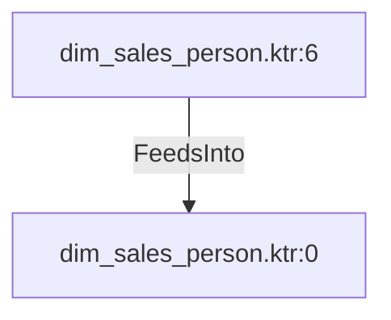

# dim_sales_person.ktr:6 (TransformNode)

## Properties

| Key | Value |
|---|---|
| `columns` | [] |
| `node_type` | Source |
| `object_name` | Sales.SalesPerson |

## Relationships

### FeedsInto

- → dim_sales_person.ktr:0 (`d3d9a08d-a353-51f5-8945-91da2a42146d`)

## Diagram

## Evidence

- `b45a6d77-5ae8-57c7-b45a-3a5c29c4c581` — Sales.SalesPerson (confidence: 1.00)
