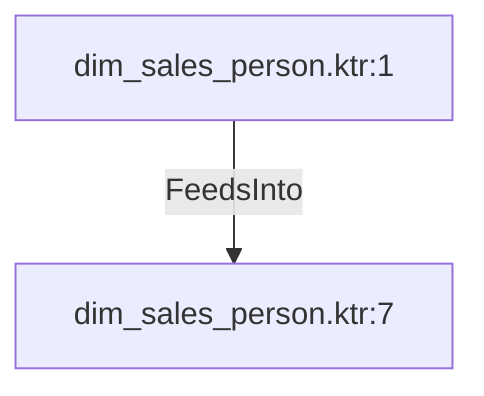

# dim_sales_person.ktr:7 (TransformNode)

## Properties

| Key | Value |
|---|---|
| `columns` | [] |
| `node_type` | Sink |
| `object_name` | dim_sales_person |

## Relationships

### FeedsInto

- ← dim_sales_person.ktr:1 (`805f3826-5f37-5e0e-955c-94101dd972dc`)

## Diagram

## Evidence

- `25525377-c6ee-5b2e-b206-1d42f849e09c` — dim_sales_person (confidence: 1.00)
