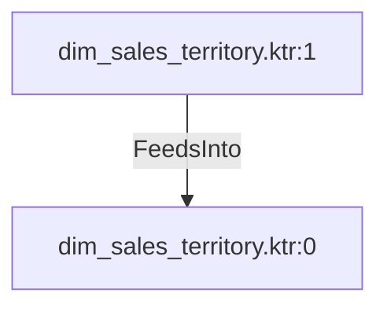

# dim_sales_territory.ktr:1 (TransformNode)

## Properties

| Key | Value |
|---|---|
| `columns` | [] |
| `node_type` | Source |
| `object_name` | Sales.SalesTerritory |

## Relationships

### FeedsInto

- → dim_sales_territory.ktr:0 (`8be5eef9-8a94-5ef1-a9a7-1e66787f8c4c`)

## Diagram

## Evidence

- `5c3b23a5-8ad1-5621-a299-ac57f3cb9d2d` — Sales.SalesTerritory (confidence: 1.00)
