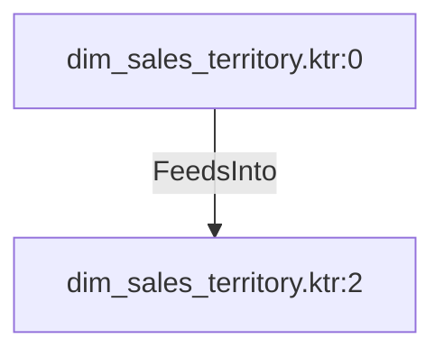

# dim_sales_territory.ktr:2 (TransformNode)

## Properties

| Key | Value |
|---|---|
| `columns` | ["Name","CountryRegionCode","TerritoryID","Sales_territory_ID","Group"] |
| `node_type` | Sink |
| `object_name` | dim_sales_territory |

## Relationships

### FeedsInto

- ← dim_sales_territory.ktr:0 (`8be5eef9-8a94-5ef1-a9a7-1e66787f8c4c`)

## Diagram

## Evidence

- `487105c1-61a0-5ae7-8be7-39693adc5383` — dim_sales_territory (confidence: 1.00)
