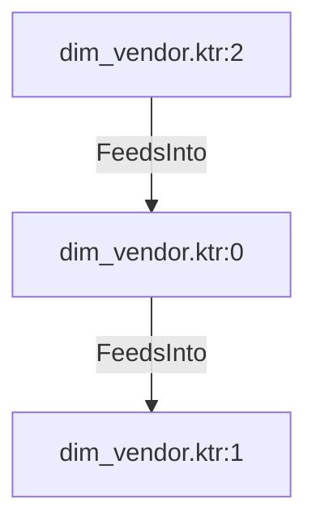

# dim_vendor.ktr:0 (TransformNode)

## Properties

| Key | Value |
|---|---|
| `node_type` | Unmapped |
| `raw` | <step>
    <name>Add sequence</name>
    <type>Sequence</type>
    <description/>
    <distribute>Y</distribute>
    <custom_distribution/>
    <copies>1</copies>
    <partitioning>
      <method>none</method>
      <schema_name/>
    </partitioning>
    <valuename>dim_vendor_id</valuename>
    <use_database>N</use_database>
    <connection/>
    <schema/>
    <seqname>SEQ_</seqname>
    <use_counter>Y</use_counter>
    <counter_name/>
    <start_at>1</start_at>
    <increment_by>1</increment_by>
    <max_value>999999999</max_value>
    <attributes/>
    <cluster_schema/>
    <remotesteps>
      <input>
      </input>
      <output>
      </output>
    </remotesteps>
    <GUI>
      <xloc>400</xloc>
      <yloc>80</yloc>
      <draw>Y</draw>
    </GUI>
  </step> |
| `reason` | unrecognized step type: Sequence |

## Relationships

### FeedsInto

- → dim_vendor.ktr:1 (`a109b5da-bf9f-55e3-8d78-4669fc7745f9`)
- ← dim_vendor.ktr:2 (`c4d59d25-c09e-5c70-89e0-14f8f6b71d91`)

## Diagram

## Evidence

- `4c98f090-3768-5d46-9307-3db9da0cd8cf` — <step>
    <name>Add sequence</name>
    <type>Sequence</type>
    <description/>
    <distribute>Y</distribute>
    <custom_distribution/>
    <copies>1</copies>
    <partitioning>
      <method>none</method>
      <schema_name/>
    </partitioning>
    <valuename>dim_vendor_id</valuename>
    <use_database>N</use_database>
    <connection/>
    <schema/>
    <seqname>SEQ_</seqname>
    <use_counter>Y</use_counter>
    <counter_name/>
    <start_at>1</start_at>
    <increment_by>1</increment_by>
    <max_value>999999999</max_value>
    <attributes/>
    <cluster_schema/>
    <remotesteps>
      <input>
      </input>
      <output>
      </output>
    </remotesteps>
    <GUI>
      <xloc>400</xloc>
      <yloc>80</yloc>
      <draw>Y</draw>
    </GUI>
  </step> (confidence: 1.00)
