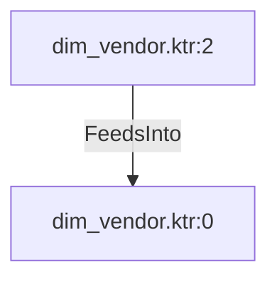

# dim_vendor.ktr:2 (TransformNode)

## Properties

| Key | Value |
|---|---|
| `columns` | [] |
| `node_type` | Source |
| `object_name` | Purchasing.Vendor |

## Relationships

### FeedsInto

- → dim_vendor.ktr:0 (`b5c7d07e-3cd7-561b-a5a5-d363ef97f6c7`)

## Diagram

## Evidence

- `660b5744-1fe5-5622-819a-91d3f7f3a3d8` — Purchasing.Vendor (confidence: 1.00)
