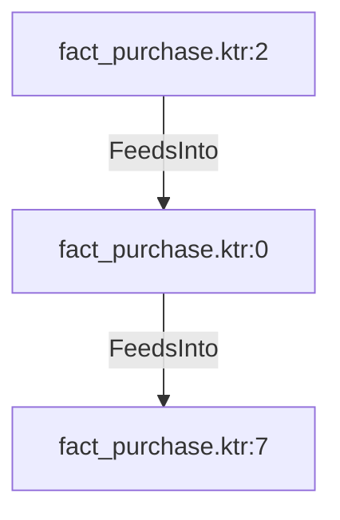

# fact_purchase.ktr:0 (TransformNode)

## Properties

| Key | Value |
|---|---|
| `node_type` | Unmapped |
| `raw` | <step>
    <name>Calculate Date Ids And Amounts</name>
    <type>Formula</type>
    <description/>
    <distribute>Y</distribute>
    <custom_distribution/>
    <copies>1</copies>
    <partitioning>
      <method>none</method>
      <schema_name/>
    </partitioning>
    <formula>
      <field_name>calculated_order_date_id</field_name>
      <formula_string>[order_date_year]*10000 + [order_date_month]*100 + [order_date_day]</formula_string>
      <value_type>Integer</value_type>
      <value_length>-1</value_length>
      <value_precision>-1</value_precision>
      <replace_field/>
    </formula>
    <formula>
      <field_name>calculated_ship_date_id</field_name>
      <formula_string>[ship_date_year]*10000 + [ship_date_month]*100 + [ship_date_day]</formula_string>
      <value_type>Integer</value_type>
      <value_length>-1</value_length>
      <value_precision>-1</value_precision>
      <replace_field/>
    </formula>
    <formula>
      <field_name>calculated_rejected_amount</field_name>
      <formula_string>[RejectedQty] * [UnitPrice]</formula_string>
      <value_type>Number</value_type>
      <value_length>-1</value_length>
      <value_precision>-1</value_precision>
      <replace_field/>
    </formula>
    <formula>
      <field_name>calculated_stocked_amount</field_name>
      <formula_string>[StockedQty] * [UnitPrice]</formula_string>
      <value_type>Number</value_type>
      <value_length>-1</value_length>
      <value_precision>-1</value_precision>
      <replace_field/>
    </formula>
    <formula>
      <field_name>calculated_received_amount</field_name>
      <formula_string>[ReceivedQty] * [UnitPrice]</formula_string>
      <value_type>Number</value_type>
      <value_length>-1</value_length>
      <value_precision>-1</value_precision>
      <replace_field/>
    </formula>
    <attributes/>
    <cluster_schema/>
    <remotesteps>
      <input>
      </input>
      <output>
      </output>
    </remotesteps>
    <GUI>
      <xloc>496</xloc>
      <yloc>112</yloc>
      <draw>Y</draw>
    </GUI>
  </step> |
| `reason` | unrecognized step type: Formula |

## Relationships

### FeedsInto

- → fact_purchase.ktr:7 (`aacf805d-ac0d-5ebe-8eb5-be7f9dea1724`)
- ← fact_purchase.ktr:2 (`38c748f9-9595-56a1-97fd-6bbd010e579f`)

## Diagram

## Evidence

- `fa026e27-f0de-53e3-820f-eac54df1924d` — <step>
    <name>Calculate Date Ids And Amounts</name>
    <type>Formula</type>
    <description/>
    <distribute>Y</distribute>
    <custom_distribution/>
    <copies>1</copies>
    <partitioning>
      <method>none</method>
      <schema_name/>
    </partitioning>
    <formula>
      <field_name>calculated_order_date_id</field_name>
      <formula_string>[order_date_year]*10000 + [order_date_month]*100 + [order_date_day]</formula_string>
      <value_type>Integer</value_type>
      <value_length>-1</value_length>
      <value_precision>-1</value_precision>
      <replace_field/>
    </formula>
    <formula>
      <field_name>calculated_ship_date_id</field_name>
      <formula_string>[ship_date_year]*10000 + [ship_date_month]*100 + [ship_date_day]</formula_string>
      <value_type>Integer</value_type>
      <value_length>-1</value_length>
      <value_precision>-1</value_precision>
      <replace_field/>
    </formula>
    <formula>
      <field_name>calculated_rejected_amount</field_name>
      <formula_string>[RejectedQty] * [UnitPrice]</formula_string>
      <value_type>Number</value_type>
      <value_length>-1</value_length>
      <value_precision>-1</value_precision>
      <replace_field/>
    </formula>
    <formula>
      <field_name>calculated_stocked_amount</field_name>
      <formula_string>[StockedQty] * [UnitPrice]</formula_string>
      <value_type>Number</value_type>
      <value_length>-1</value_length>
      <value_precision>-1</value_precision>
      <replace_field/>
    </formula>
    <formula>
      <field_name>calculated_received_amount</field_name>
      <formula_string>[ReceivedQty] * [UnitPrice]</formula_string>
      <value_type>Number</value_type>
      <value_length>-1</value_length>
      <value_precision>-1</value_precision>
      <replace_field/>
    </formula>
    <attributes/>
    <cluster_schema/>
    <remotesteps>
      <input>
      </input>
      <output>
      </output>
    </remotesteps>
    <GUI>
      <xloc>496</xloc>
      <yloc>112</yloc>
      <draw>Y</draw>
    </GUI>
  </step> (confidence: 1.00)
