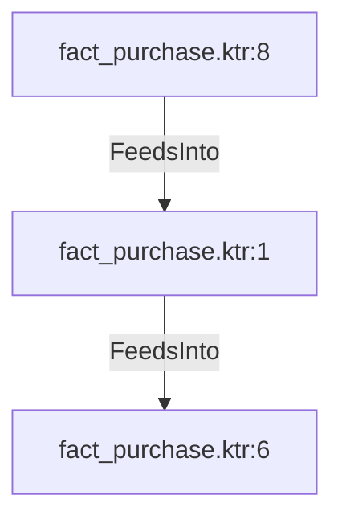

# fact_purchase.ktr:1 (TransformNode)

## Properties

| Key | Value |
|---|---|
| `node_type` | Unmapped |
| `raw` | <step>
    <name>Calculate Is Received</name>
    <type>ScriptValueMod</type>
    <description/>
    <distribute>Y</distribute>
    <custom_distribution/>
    <copies>1</copies>
    <partitioning>
      <method>none</method>
      <schema_name/>
    </partitioning>
    <compatible>N</compatible>
    <optimizationLevel>9</optimizationLevel>
    <jsScripts>
      <jsScript>
        <jsScript_type>0</jsScript_type>
        <jsScript_name>Script 1</jsScript_name>
        <jsScript_script>var calculated_received_flag = Status == 4;
</jsScript_script>
      </jsScript>
    </jsScripts>
    <fields>
      <field>
        <name>calculated_received_flag</name>
        <rename>calculated_received_flag</rename>
        <type>Boolean</type>
        <length>-1</length>
        <precision>-1</precision>
        <replace>N</replace>
      </field>
    </fields>
    <attributes/>
    <cluster_schema/>
    <remotesteps>
      <input>
      </input>
      <output>
      </output>
    </remotesteps>
    <GUI>
      <xloc>704</xloc>
      <yloc>304</yloc>
      <draw>Y</draw>
    </GUI>
  </step> |
| `reason` | unrecognized step type: ScriptValueMod |

## Relationships

### FeedsInto

- → fact_purchase.ktr:6 (`6331067b-8cd0-53c7-91f2-feb9791df119`)
- ← fact_purchase.ktr:8 (`9ecd6f0e-b556-5b18-9afc-e9fdabc61e95`)

## Diagram

## Evidence

- `b7462004-a0f1-5994-afcf-a349d58ab866` — <step>
    <name>Calculate Is Received</name>
    <type>ScriptValueMod</type>
    <description/>
    <distribute>Y</distribute>
    <custom_distribution/>
    <copies>1</copies>
    <partitioning>
      <method>none</method>
      <schema_name/>
    </partitioning>
    <compatible>N</compatible>
    <optimizationLevel>9</optimizationLevel>
    <jsScripts>
      <jsScript>
        <jsScript_type>0</jsScript_type>
        <jsScript_name>Script 1</jsScript_name>
        <jsScript_script>var calculated_received_flag = Status == 4;
</jsScript_script>
      </jsScript>
    </jsScripts>
    <fields>
      <field>
        <name>calculated_received_flag</name>
        <rename>calculated_received_flag</rename>
        <type>Boolean</type>
        <length>-1</length>
        <precision>-1</precision>
        <replace>N</replace>
      </field>
    </fields>
    <attributes/>
    <cluster_schema/>
    <remotesteps>
      <input>
      </input>
      <output>
      </output>
    </remotesteps>
    <GUI>
      <xloc>704</xloc>
      <yloc>304</yloc>
      <draw>Y</draw>
    </GUI>
  </step> (confidence: 1.00)
