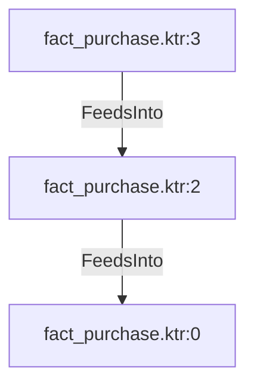

# fact_purchase.ktr:2 (TransformNode)

## Properties

| Key | Value |
|---|---|
| `node_type` | Unmapped |
| `raw` |  |
| `reason` | Calculator step has no recognizable calculated fields |

## Relationships

### FeedsInto

- → fact_purchase.ktr:0 (`8ef59248-d2ee-5fee-a746-e41ca8eeee69`)
- ← fact_purchase.ktr:3 (`57e3eb81-6e91-5f84-96c2-6095e5f42e04`)

## Diagram

## Evidence

- `cd53449c-8bb2-5f40-b4cc-24c346aef067` —  (confidence: 1.00)
