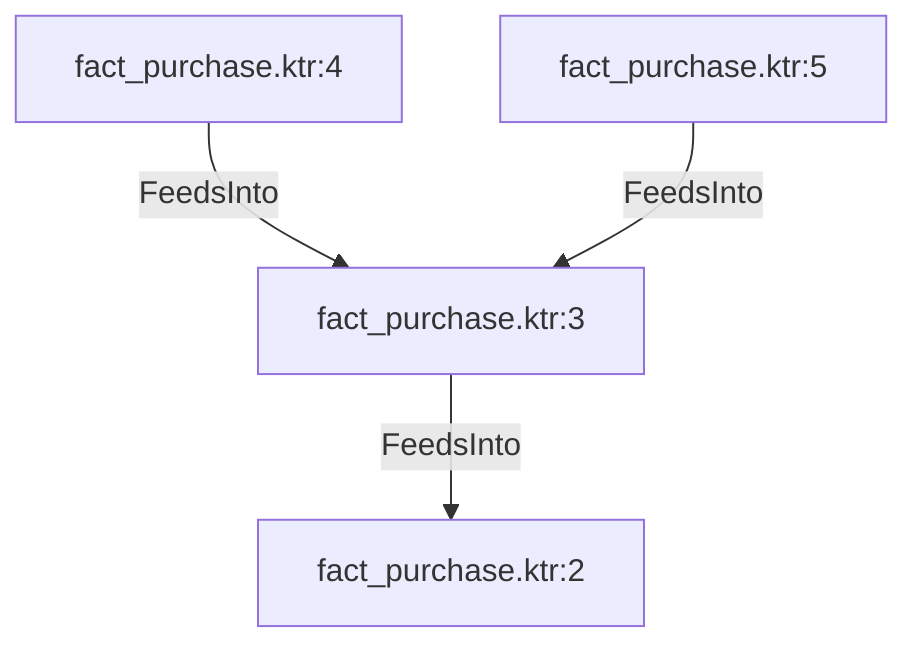

# fact_purchase.ktr:3 (TransformNode)

## Properties

| Key | Value |
|---|---|
| `join_kind` | Left |
| `keys` | [] |
| `left` | 0 |
| `node_type` | Join |
| `right` | 0 |

## Relationships

### FeedsInto

- → fact_purchase.ktr:2 (`38c748f9-9595-56a1-97fd-6bbd010e579f`)
- ← fact_purchase.ktr:4 (`aa055a34-9576-5f4e-9d38-382816f185f9`)
- ← fact_purchase.ktr:5 (`f2f850a9-507a-57b8-991b-8a881da3a48b`)

## Diagram

## Evidence

- `169298c8-b52c-5e06-9846-6553bcbfbbd8` — Left JOIN ON [] (confidence: 1.00)
