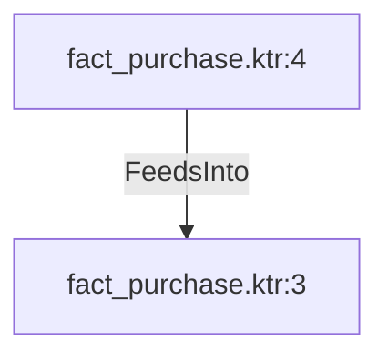

# fact_purchase.ktr:4 (TransformNode)

## Properties

| Key | Value |
|---|---|
| `columns` | [] |
| `node_type` | Source |
| `object_name` | Purchasing.PurchaseOrderDetail |

## Relationships

### FeedsInto

- → fact_purchase.ktr:3 (`57e3eb81-6e91-5f84-96c2-6095e5f42e04`)

## Diagram

## Evidence

- `673be702-0573-54f0-8ef9-1e8d68a8f101` — Purchasing.PurchaseOrderDetail (confidence: 1.00)
