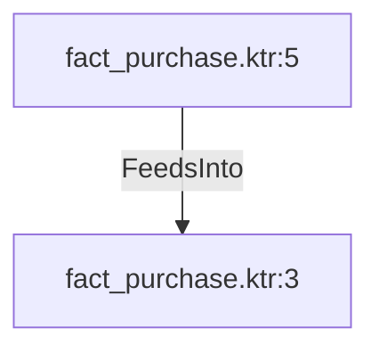

# fact_purchase.ktr:5 (TransformNode)

## Properties

| Key | Value |
|---|---|
| `columns` | [] |
| `node_type` | Source |
| `object_name` | Purchasing.PurchaseOrderHeader |

## Relationships

### FeedsInto

- → fact_purchase.ktr:3 (`57e3eb81-6e91-5f84-96c2-6095e5f42e04`)

## Diagram

## Evidence

- `d5afb75b-52a6-5681-8ce9-672f25bcd942` — Purchasing.PurchaseOrderHeader (confidence: 1.00)
