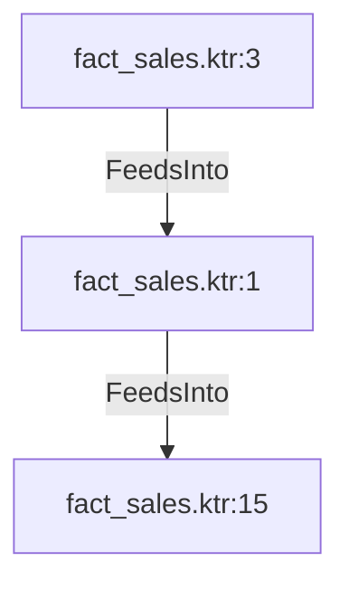

# fact_sales.ktr:1 (TransformNode)

## Properties

| Key | Value |
|---|---|
| `node_type` | Unmapped |
| `raw` | <step>
    <name>Calculate Sales Profit</name>
    <type>Formula</type>
    <description/>
    <distribute>Y</distribute>
    <custom_distribution/>
    <copies>1</copies>
    <partitioning>
      <method>none</method>
      <schema_name/>
    </partitioning>
    <formula>
      <field_name>calculated_sales_profit</field_name>
      <formula_string>([UnitPrice] - [StandardCost]) * [OrderQty]</formula_string>
      <value_type>Number</value_type>
      <value_length>-1</value_length>
      <value_precision>-1</value_precision>
      <replace_field/>
    </formula>
    <attributes/>
    <cluster_schema/>
    <remotesteps>
      <input>
      </input>
      <output>
      </output>
    </remotesteps>
    <GUI>
      <xloc>608</xloc>
      <yloc>208</yloc>
      <draw>Y</draw>
    </GUI>
  </step> |
| `reason` | unrecognized step type: Formula |

## Relationships

### FeedsInto

- → fact_sales.ktr:15 (`7a2fa30b-5744-577e-af2c-f32b427aeb22`)
- ← fact_sales.ktr:3 (`699832f8-de69-55f9-966f-acf7612b60b1`)

## Diagram

## Evidence

- `2a5f5c89-fb74-5632-9cd8-885250c86994` — <step>
    <name>Calculate Sales Profit</name>
    <type>Formula</type>
    <description/>
    <distribute>Y</distribute>
    <custom_distribution/>
    <copies>1</copies>
    <partitioning>
      <method>none</method>
      <schema_name/>
    </partitioning>
    <formula>
      <field_name>calculated_sales_profit</field_name>
      <formula_string>([UnitPrice] - [StandardCost]) * [OrderQty]</formula_string>
      <value_type>Number</value_type>
      <value_length>-1</value_length>
      <value_precision>-1</value_precision>
      <replace_field/>
    </formula>
    <attributes/>
    <cluster_schema/>
    <remotesteps>
      <input>
      </input>
      <output>
      </output>
    </remotesteps>
    <GUI>
      <xloc>608</xloc>
      <yloc>208</yloc>
      <draw>Y</draw>
    </GUI>
  </step> (confidence: 1.00)
