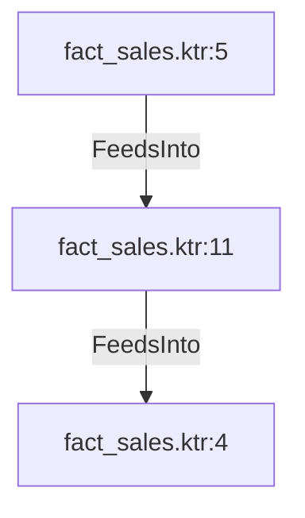

# fact_sales.ktr:11 (TransformNode)

## Properties

| Key | Value |
|---|---|
| `node_type` | Unmapped |
| `raw` | <step>
    <name>Sort Product Cost History</name>
    <type>SortRows</type>
    <description/>
    <distribute>Y</distribute>
    <custom_distribution/>
    <copies>1</copies>
    <partitioning>
      <method>none</method>
      <schema_name/>
    </partitioning>
    <directory>%%java.io.tmpdir%%</directory>
    <prefix>out</prefix>
    <sort_size>1000000</sort_size>
    <free_memory/>
    <compress>N</compress>
    <compress_variable/>
    <unique_rows>N</unique_rows>
    <fields>
      <field>
        <name>ProductCostHistoryProductId</name>
        <ascending>Y</ascending>
        <case_sensitive>N</case_sensitive>
        <collator_enabled>N</collator_enabled>
        <collator_strength>0</collator_strength>
        <presorted>N</presorted>
      </field>
    </fields>
    <attributes/>
    <cluster_schema/>
    <remotesteps>
      <input>
      </input>
      <output>
      </output>
    </remotesteps>
    <GUI>
      <xloc>528</xloc>
      <yloc>592</yloc>
      <draw>Y</draw>
    </GUI>
  </step> |
| `reason` | unrecognized step type: SortRows |

## Relationships

### FeedsInto

- → fact_sales.ktr:4 (`8eb94913-b4b9-5d88-915d-7fb890edd830`)
- ← fact_sales.ktr:5 (`4583d87d-d023-56e0-8ccd-9bf4029229da`)

## Diagram

## Evidence

- `2a4951dc-dc5c-5778-a679-376fad6ca6d6` — <step>
    <name>Sort Product Cost History</name>
    <type>SortRows</type>
    <description/>
    <distribute>Y</distribute>
    <custom_distribution/>
    <copies>1</copies>
    <partitioning>
      <method>none</method>
      <schema_name/>
    </partitioning>
    <directory>%%java.io.tmpdir%%</directory>
    <prefix>out</prefix>
    <sort_size>1000000</sort_size>
    <free_memory/>
    <compress>N</compress>
    <compress_variable/>
    <unique_rows>N</unique_rows>
    <fields>
      <field>
        <name>ProductCostHistoryProductId</name>
        <ascending>Y</ascending>
        <case_sensitive>N</case_sensitive>
        <collator_enabled>N</collator_enabled>
        <collator_strength>0</collator_strength>
        <presorted>N</presorted>
      </field>
    </fields>
    <attributes/>
    <cluster_schema/>
    <remotesteps>
      <input>
      </input>
      <output>
      </output>
    </remotesteps>
    <GUI>
      <xloc>528</xloc>
      <yloc>592</yloc>
      <draw>Y</draw>
    </GUI>
  </step> (confidence: 1.00)
